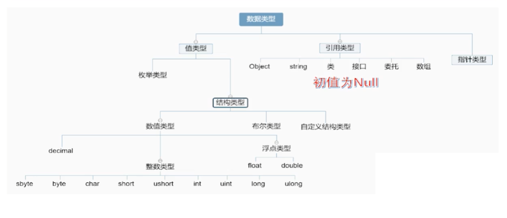

# 进制转换

#### 进制转换

##### 二进制转10进制

不为0的位用1*2的该位的次方，从0次方开始

1111 1111 1111 每一位都对应了2的倍数，可以直接加起来

1024 512 256 128 64  32 16 8 4 2 1

0001 0010 =》 
$$
1*2^1 + 1* 2^4 = 18
$$
 1101 =》 
$$
1*2^0+ 1*2^2 + 1*2 ^3 = 13
$$
0101 1010 =>
$$
2 + 8 + 16 +64 = 90
$$

##### 八进制转10进制

$$
8^0 + 8^1 + 8^2 + 8^3
$$

1217 =>
$$
7*8^0 + 1 * 8^1 + 2*8^2 + 1*8^3
$$

##### 16进制转10进制 


$$
16^0 + 16^1 + 16^2 + 16^3
$$

##### x进制转10进制 

p0,p1,p2 表示从右数第几位上的数字
$$
p0 * x^0 + p1 * x^1 + p2 * x^3 +...
$$

#### x进制转二进制

##### 十进制转二进制

**1.一直除2，把余数反过来写** 

10=》除数 余数

10/2      5     0

5/2        2     1

2/2        1     0

1/2         0    1 => 1010

**2.就近组合** 

300 = 256 + 32 + 8 + 4所以

300 =》 256 = 2^8 32 =2^5 8 = 2^3 4=2^2

300 => 0001 0010 1100 '

##### 八进制转二进制

将八进制数的每一位转成3位二进制然后组合起来

77 => 111 + 111' = 0011 1111

34 =>  011 100 => 0001 1100

##### 十六进制转二进制

将16进制数的每一位转成思维的二进制数然后组合起来
F1 => 15 +1 = > 1111 0001 => 1111 0001

A4 => 10 +4 => 1010 0100 => 1010 0010

####  补码 反码 原码

##### 二进制表示正负数

0表示正号，1表示负号

-1=> 11  -2 => 110

##### 正数的原码反码补码是一样的

0111 原码 0111 补码0111 反码 0111

##### 负数的原码反码补码

负数的反码：原码除符号位每个位取反 1变0 0变1

负数的补码：反码+1

-7=>1111 =>原码 1111  反码 1000 补码 1001

##### -0的反码和补码

-0 => 1000 0000 =>反码 11111111=>补码 0000 0000 = +0

所以-0 的补码是0

##### 正负数进行计算

超出的位数直接舍弃

不用补码 5 + (-2) 1010 1011
$$
0101
+	1010 
= 1111 = 7 错误！
$$
使用补码进行5+(-2)计算
$$
0101+ 1110 = 0011 = 3 正确！
$$

##### 练习

原码				反码				补码

1 011				1 100   			1 101

0101				0010				0011

1011 1010		1100 0101     1100 0110


###### 3+5 

$$
0011 + 0101 = 1000 = 8
$$

###### 10+7

1010

0111 =>    0001 0001 = 17
$$
1010 + 0111 = 0001 0001 = 17
$$

###### -5 + 18

$$
-5补码1111 1011 + 0001 0010 = 10000 1100 把超出八位的舍去= 0000  1101 = 13
$$

###### -8 + 20

$$
-8补码 1111 1000  + 0001 0100 = 10000 1100 把超出八位的舍去 => 0000 1100 = 12
$$

#  C#

## 几种注释用法

```
帮助注释,可以用于注释类,方法,枚举,构造体等等,可以在调用时,鼠标悬停到对应类,方法上时展示注释的文字
/// <summary>
/// Person
/// </summary>

单行注释
//xxxx

//注释一快代码,可以进行折叠.
#region
代码...
#endregion
```


## 常用内置对象

### Random 随机对象

```c#
Random ran = new Random();
//随机返回一个最大最小范围内的数
int rnum  = ran.Next(1,100);
```


## Console.Write()几种用法

按顺序输出变量


`Console.Write("{0},{1}","1","2")`

可以直接输出变量

`Console.WriteLine($"{h}");`

## VS Studio

解决方案里可以存在多个项目，类似于其他语言的共层

可以与项目同名也可以单独命名。


## 复合运算符

#### += -=  乘等  除等 余等


## 基本输入 输出函数

#### 输出

```
Console.WriteLine();//不换行
Console.Write();//换行
```

#### 输入

```
Console.Read();//读取用户输入的一个字符，并返回该字符对应的整型字符
Console.ReadLine();//读取用户输入的一串字符串，并返回该字符
```


### 类型转换

bool，int ，float ， string ，char 互相转换

#### 隐式转换

```
sbyte sb = 100;
int i = sb;//隐式转换，小转大
long l = i;
float f = i
double d = i;
```


#### 显式转换（强制转换）

#### 数字之间转换

需要强制转换运算符，由大变小需要强制转换。会丢失进度。

将取值范围大，精度高的转换为取值范围小，进度小的。

```
short=>sbyts = 0000 0011 0000 0000 = 728 => 0000 0000 = 0

int i = (int)105.5f;//105 小数点后都省去
```

一般使用强制转换要确定大类型的数在小类型的的范围内。


#### 数字和其他类型进行转换

##### 数字与字符 可以转换

```
char c = (char)100;//z
```


##### 数字与布尔类型不能转换


##### 字符串与其他类型进行转换

###### Convert方法

```
bool c = false;
string ss = "faLse";
string s = Convert.ToString(c);//False
int i = Convert.ToInt32(c);//0
bool b = Convert.ToBoolean(c);//False
```


###### .parse()

- int.Parse()
- bool.Parse()
- float.Parse()
- char.Parse()

```
float f = float.Parse("10200.23");
```

###### 其他类型转成字符串

- .ToString()方法

  ```
  string s = 123.ToString();
  ```

  

## 关系运算符 > < >= <= != ==

## 逻辑运算符布尔与布尔之间进行运算 &  && | || !

### && 短路与 

如果第一个条件已经得知整个逻辑运算结果就不会去判断第二个条件。

缺点如果第二个条件带有计算，那么就不会进行计算。

```
int num = 20;
int result = num++ <30&& --num;
Console.Write(num); 21
```


 ## 分支结构

### switch


```
int a = 10;
switch(a)
 case 10:
 	Console.Write(1);
 	break
 default:
 	Console.Write(2);
```


### 循环

1. for循环最常用,通常用于知道循环次数的情况.
2. while.通常用于不知道循环次数的情况
3. do while 不常用,通常用于先执行一次的情况.
4. break跳出本层循环,continue结束本次循环,通常与if连用.

### 数组

定义数组后必须对数组初始化才能使用

- 动态初始化 数据类型 [] 变量名 = new 数据类型[数组长度]{元素1,元素2}

  int 数组默认值为0,bool数组默认值faslse,float数组默认值为0,char数组默认值为'',sring数组默认值为null

  这种情况可以将定义和初始化分开.

```
int[] age;
age = new int[3]//此时数组元素为默认值
int[] age = new int[3] { 1, 2, 3 };


```

- 静态初始化

  这种情况不能将定义和初始化分开

  ```
  int[] age = {1,2,3}
  
  ```


访问数组时如果下标对应的数组不存在,就会发生数组越界异常

#### 遍历数组


#### 二维数组

有两个下标的数组,数组的元素还是数组.

##### 动态初始化

动态初始化时可以指定长度

```
int[,] arr;
int[,] arr2;
arr = new int[2,3] { { 1, 2, 3 }, { 1, 2, 3  } };
arr2 = new int[,] { };
```


##### 静态初始化

静态初始化不能指定长度

```
int[,] arr3 = { { 1, 2, 3 }, { 1, 2, 3 } };
```

##### 二维数组的长度

直接访问二维数组的.Length属性,默认返回数组中所有元素的个数(总长度)

```C#
int[,] a =
    {
        {1,2,3 },
        {4,5,6 }
    };
 Console.WriteLine(a.Length);//6
```

<p style='color:red;font-weight:700;'>获取真正二维数组的长度,GetLength(维度),并遍历二维数组</p>

```
int[,] a =
{
    {1,2,3 },
    {4,5,6 }
};
for (int i = 0; i < a.GetLength(0); i++)
{
    for (int j = 0; j < a.GetLength(1); j++)
    {
        Console.WriteLine(a[i, j]);
    }
}
```

##### foreach

foreach用于迭代遍历可迭代的数据,比如数组,字符串.

<p style='color:red;font-weight:700;'>
    迭代类型可以使用var表示模糊类型
</p>


foreach(迭代类型 迭代变量名 in 迭代集合){

​	循环体

}

<p style='color:red;font-weight:700;'>
    迭代变量是只读的,不能修改.
    且foreach性能消耗的,建议使用for
</p>


```
int[,] a =
{
    {1,2,3 },
    {4,5,6 }
};
foreach (var item in a)
{
    Console.WriteLine(item);//1 2 3 4 5 6 
}
```

### 枚举和结构体

#### 枚举(值类型)


枚举类型时自定义类型,要定义在main函数外面.

```
class Game {
    enum WeaponType
        {
            Gun,
            Knife
        }
        static void Main(string[] args)
        {
            WeaponType gun = WeaponType.Gun;
            WeaponType knife = WeaponType.Knife;
            Console.WriteLine(gun);//Gun
        }
}
```

每一个枚举类型对应一个整型编号,可以通过强制转换来互相转换

```
WeaponType gun = WeaponType.Gun;
int gunIndex = (int)WeaponType.Gun;
Console.WriteLine(gunIndex);//0
gun = (WeaponType)0;
Console.Write(gun);//Gun
```

<p style='color:red;font-weight:700;'>枚举类型可以在定义时指定一个整数,若不指定则会根据前一个枚举进行递增,也可以进行++ -- 操作</p>

```
enum WeaponType
    {
        Gun=100,
        Knife
    }
static void Main(string[] args)
    {
    	WeaponType knife = WeaponType.Knife;
    	Console.Write(--knife);//Gun
    	Console.write((WeaponType)101);//Knife
    
    }
```

### 结构体struct(值类型)

枚举类型时自定义类型,要定义在main函数外面.

结构体是自定义类型

struct 结构体名 {结构体内容}

结构体内不能有初始值.

```
struct Student
{
    public string name;
    public int age;
}

Student s;
s.name = "lhc";
s.age = 20;
```

#### 结构体构造函数

构造函数是在构造结构体时调用的函数,

构造函数在结构体内创建,自定义的构造函数必须对所有的字段进行初始化 

<span style='color:red'>构造函数中如果传入构造函数的参数与构造体的参数名字不一样可以省略this,否则必须有this</span>

```c#
struct Student
    {
        public string name;
        public int age;
        public string male;
        public Student(string name,int age,string peopleMale)
        {
            this.name = name;
            this.age = age; 
            male = peopleMale
        }
    }
    
 Student s = new Student("lhc", 20);
```

#### 创建一个英雄装备结构体.


```c#
enum EquipmentType
{
    AdEquipment,
    ApEquipment
}
struct HeroEquipment
 {
        public string equipmentName;
        public int attack;
        public int ap;
        public EquipmentType eqType;
        public HeroEquipment(string equipmentName, int attack,int ap, EquipmentType eqType)
        {
            this.equipmentName = equipmentName;
            this.attack = attack; 
            this.ap = ap;
            this.eqType = eqType;
        }
}

HeroEquipment adEquipment = new HeroEquipment("饮血剑",100,0,EquipmentType.AdEquipment);
```


#### 练习

创建部门电话枚举,900代表市场部,800代表人力部,700代表行政部,701代表财务部

```
enum Phone { 
        Market=900,
        People=800,
        Xz=700,
        Fund
        }
```

### 访问修饰符

- public（公共的）： 类型或成员所在大括号内外都能访问到
- private（私有的）：同一类或结构中的代码可以访问，类型或所在大括号内可以访问
- protected（受保护的）：同一类或结构或此类的派生类中的代码可以访问
- internal（内部的）：同一程序集中的任何代码都能访问，但其他程序集中的代码不可访问
- protected internal（受保护内部的）：当前程序集或从包含派生类的类型的类别


### 面向对象

面向对象是把构成问题的事务分解成各个对象，建立对象的目的不是为了完成某个步骤，而是为了描述某个事物在整个解决问题的步骤中的行为。

优点：易扩展，易复用，易维护

### 类

类是具备某些共同特征的实体的集合，是一种抽象的数据类型

#### 创建类

**类的字段可以设置初始值**

**且类的字段默认修饰符为private**

一个对象在创建后，需要进行实例化才能使用，对象在进行new 操作符后才分配了内容

`类名 对象名= new 类名()`


#### 类的方法

方法就是用来描述一个类的行为，封装了一段有特定功能的代码段

定义方法

`访问修饰符 返回值类型 方法名(参数列表){代码块 }`

调用方法

`返回值类型 变量名 = 对象名.方法名(实参列表)`

方法使用大驼峰命名

void表示无返回值

##### 方法中的this

方法中的this一般执向调用的对象.如果没有重名一般可以忽略.

##### return

返回结果,中止方法.

#### 类的属性及访问器


**建议将属性默认设置为private**,通过访问器来访问.

访问器的命名方式建议为大驼峰

可以通过类的属性访问器快捷设置属性的可读可写,只读,只写.

如果不设置set访问器,则认为该属性为只读的,

如果不设置get访问器,则认为该属性为只写的,value则认为是写入的值.

```c#
    class Hero
    {
        private int hp;
        public int Age {set;get; }
        public int Hp
        {
            get { 
               	Console.WriteLine("Hp reading!");
                return this.hp; 
            }
            set { this.hp = value; }
        }

    }
Hero lhc = new Hero();
lhc.Hp = 1422;
Console.WriteLine(lhc.Hp);//1422
```

访问器可以写其他语句,可以对属性进行一些处理.或者设置其他属性

**<span style='color:red'>不要set里继续set或不要再get继续get,否则会死循环.</span>**

get和set可以设置private,在当前类可见,在当前类以外不可读不可写.


#### 方法的参数

##### 形参

函数接受的形式参数,和函数外的同名参数不互相影响,只在函数内能访问到.

##### 实参

传递给方法的实际参数.

##### 引用参数

**引用参数必须赋初值!**

**引用类型一般用在值类型参数前面**

传入实参时带上ref关键字,就能使该参数变成引用参数.函数内对参数的操作会影响外面的参数.

```typescript
    static void Main(string[] args)
    {
         void ChangeNum(ref int v1,ref int v2)
        {
            int temp = v1;
            v1 = v2;
            v2 = temp;
                    
        }
        int v1 = 20;
        int v2 = 30;
        ChangeNum(ref v1, ref v2);
        Console.WriteLine($"{v1},{v2}");//30 20
    }
```

##### 输出参数

方法的参数前面加out关键字,可以将该参数定义为输出参数,作为函数的出口,可以定义多个输出参数,所以可以返回多个结果.

调用方法时也要在输出参数前加out.

```
static void Main(string[] args)
    {
        void ChangeNum(int v1,int v2 ,out int r1,out int r2)
        {
            r1 = v1 + v2;
            r2 = v1 * v2;
                    
        }
        int v1 = 20;
        int v2 = 30;
        ChangeNum(v1, v2,out int r1,out int r2);
        Console.WriteLine($"{r1}---{r2}");//50---500
        
    }
```

##### 数组参数

数组参数只能用在参数列表最后，且类型必须一样。

```c#
void fo(int b,int c,params int[] a)
        {
            foreach (int i in a)
            {
                Console.WriteLine(i);
            }
        }
        fo(1, 2, 4, 5, 6, 7, 8);//45678
    }
```

##### 默认值参数

参数默认值必须放在必须参数后面。

```c#
void fo(int c, int b = 20, params int[] a)
        {
            foreach (int i in a)
            {
                Console.WriteLine(i);
            }
        }
        fo(20, 2, 4, 5, 6, 7);
```


####  变量的作用域

​	局部变量使用前必须赋初值。



`


