# 计算机网络

## 第一章 
### 1.1 互联网在信息时代的作用
#### 三网融合
**电信网络，有线电视网络，计算机网络融合**
#### Internet
  - 因特网：推荐，但未被推广
  - 互联网：目前流行最广，事实上的标准译名
  - 互联网≠互连网
    - 局部范围内互连起来的计算机网络

#### 互联网是什么
- 应用和服务
- 工作原理
  - 互连结构，交换技术...
  - TCP/IP体系结构和协议...

#### 互联网的两个基本特点
- 连通性
- 资源共享

### 1.2 概述

### 1.3 计算机网络的类别

#### 计算机网络的定义

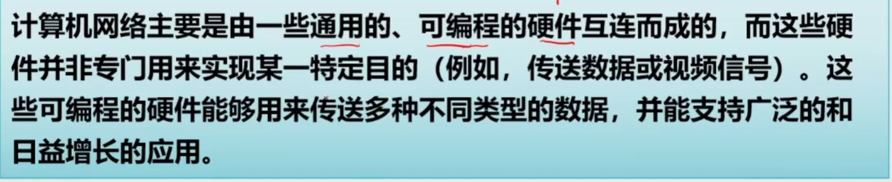</img>

**通俗定义**

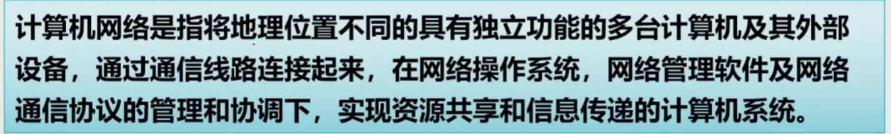</img>

#### 计算机网络分类

##### 按作用范围分
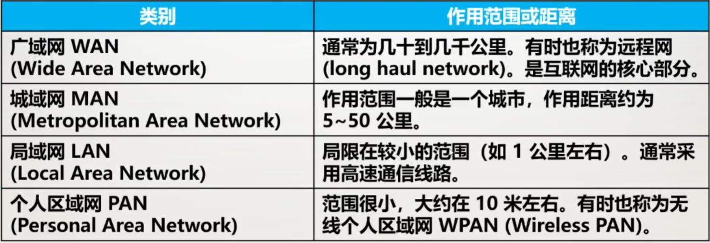</img>

##### 按使用者分
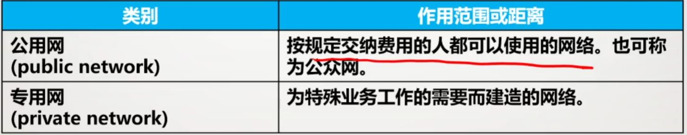</img>

##### 接入网AN（Access Net）
**用来把用户接入互联网的网络**

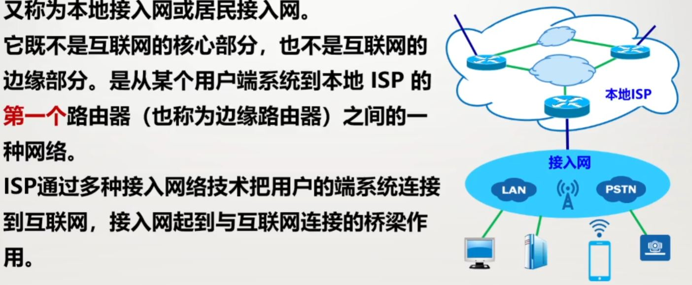</img>

### 1.4 计算机网络的性能

- 速率
  
计算机中表示文件大小通常用 100MB 10KB 1GB等等，这里 KB = 2^10Byte（字节） = 2^10*8 比特， MB = 2^20Byte（字节） = 2^20*8 比特, GB = 2^30Byte（字节） = 2^30*8 比特, 而表示速率则通常是 100Kbit/s 1Mbit/s 1Gbit/s 这里 k = 10^3， M = 10^6 ，G = 10^9

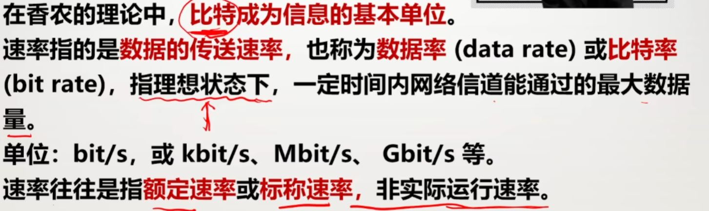</img>

- 带宽
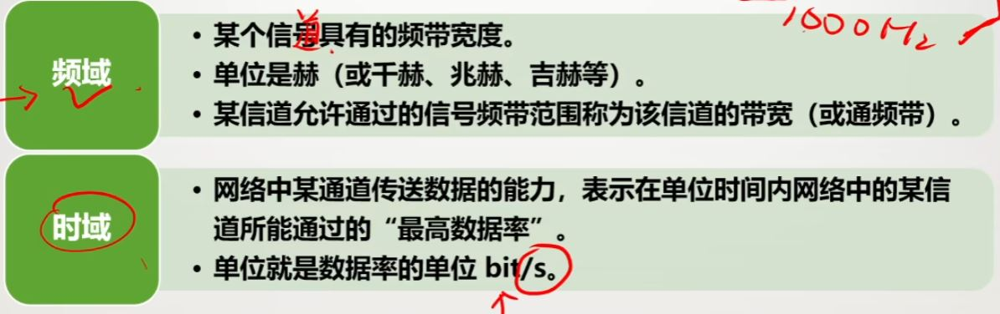</img>

- 吞吐量：单位时间内通过某个网络（或通道、接口）的实际数据量，受网络的的带宽或网络的额定速率限制，额定速率是绝对上限值，吞吐量可能会远小于额定速率，甚至下降到零（网络拥塞）

- 时延：指数据（一个报文或分组、甚至比特）从网络（或链路）的一端送到另一端所需的时间 
  - 发送时延：主机或路由器发送数据帧所需要的时间，也就是从发送数据帧的第一个比特算起，到该帧最后一个比特发送完所需的时间，发生在机器内部的发送器中，与传输信道的长度（或信号传送的距离）没有任何关系
  - 传播时延：电磁波在管道中传播一定距离需要花费的时间，发生在机器外部的传输信道媒体上，而与信号的发送速率无关。信号传送的距离越远，传播时延就越大。
  - 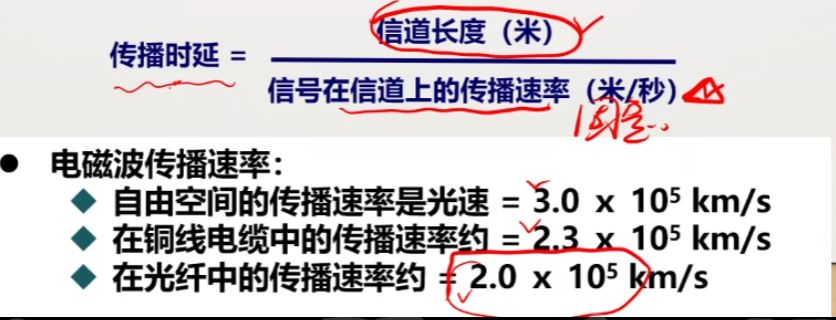</img>
  - 处理时延：主机或路由器在收到分组时，为处理分组（分析首部、提取数据、差错检验或查找路由）所花费的时间。
  - 排队时延：分组在路由器输出队列中排队等待处理和转发所经历的时延。
  - 总时延 = 发送时间 + 传播时延 + 处理时延 + 排队时延 
- 时延带宽积
  - 时延带宽积= 传播时延 * 贷款 ，即按比特计数的链路长度
  - 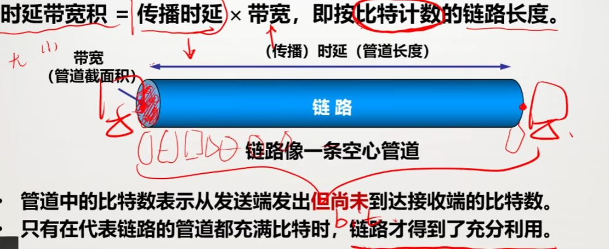</img>
- 往返时间RTT（Round-Trip Time）：表示从发送方发送完数据，到发送方收到来自接受方的确认总共经历的时间。 
  - 发送时间   = 数据长度/发送速率
  - 有效数据率 = 数据长度/总时延 = 数据长度/（发送时延 + RTT ）
  - 互联网中，往返时间 还包括各中间结点的处理时延，排队时延以及转发数据时的发送时延。
- 利用率
  - 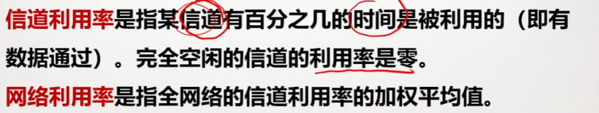</img>
  - 当某信道利用率增大时，时延会迅速增加。
  - 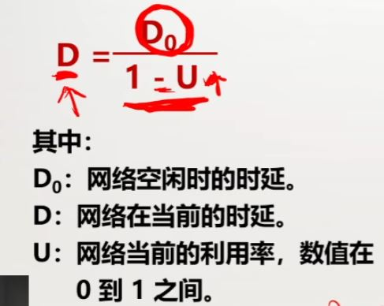</img>

### 1.5 计算机网络的体系结构

**网络体系结构是计算机网络的各层及其协议的集合，就是这个计算机网络及其构建所完成的功能的精确定义**

#### 网络协议（network protocol）
**简称为协议，是为进行网络中的数据交换而建立的规则标准或约定**
由语法、语义、同步组成
- 语法：规定传输数据的格式，解决交换信息的格式问题
- 语义：规定所要完成的功能，解决做什么的问题
- 规定各种操作的顺序，又称为时序，解决什么时间什么条件下做什么特定操作的问题

#### 具有五层协议的体系结构
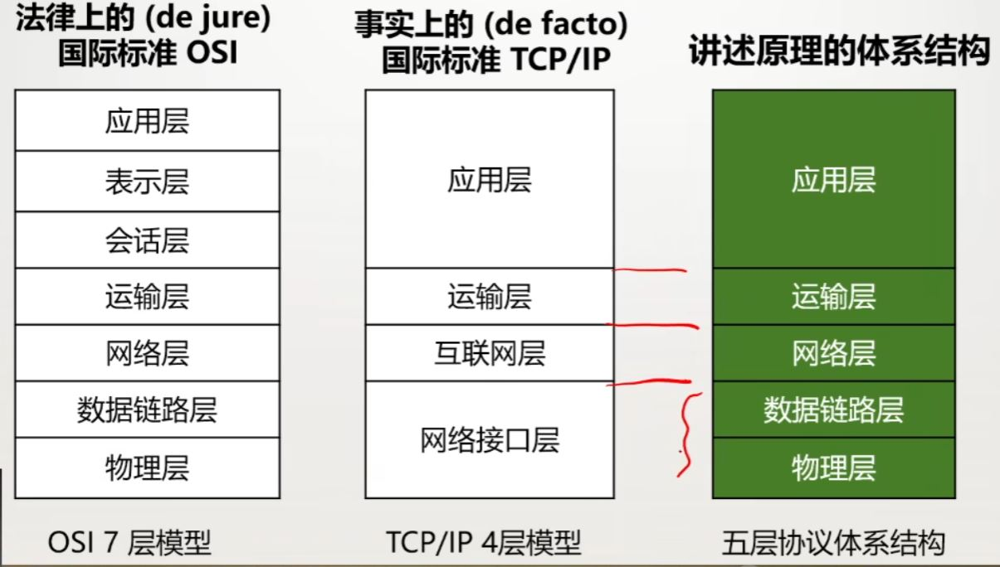</img>

#### 实体、协议、服务和服务访问点
- 实体（entity）：表示任何可发送或接受信息的硬件或软件进程
- 协议：控制两个对等实体进行通信的规则集合
- 服务：在协议的控制下，两个对等实体的通信使得本层能够向上层提供服务，要实现本层协议，还需要使用下层所提供的服务
