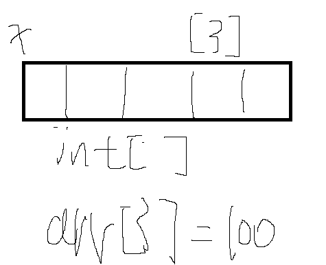
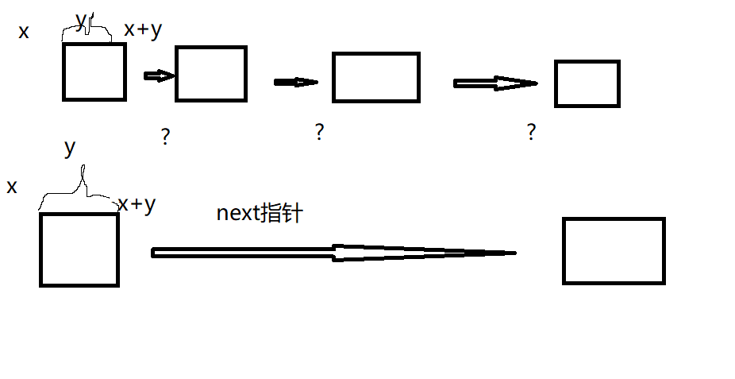
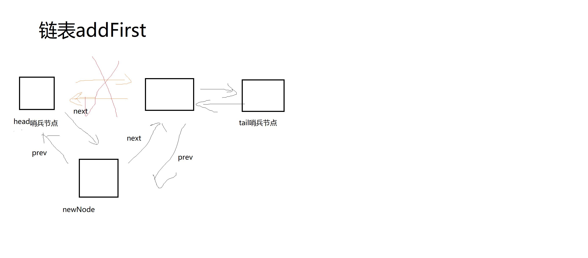
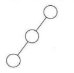
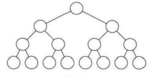
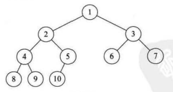

## 算法

#### 算法的定义

1. 算法是解决特定问题求解步骤的描述，在计算机中表现为指令的有限序列，并且每条指令表示一个或多个操作。
2. 算法特性
   1. 输入输出：算法具有零个或多个输入，具有至少一个或多个输出
   2. 有穷性：指算法在执行有限的步骤之后，自动结束而不会无限循环。
   3. 确定性：算法的每一步骤都具有确定的含义。
   4. 可行性：算法的每一步都必须是可行的，也就是说每一步都能够通过执行有限次数完成。
#### 算法设计要求
1. 正确性：指算法至少应该具有输入、输出和加工处理无歧义性、能正确反映问题的需求、能够得到问题的正确答案。
2. 可读性：算法设计的另一目的是为了便于阅读、理解和交流。
3. 健壮性：当输入数据不合法时，算法也能做出相关处理，而不是产生异常或莫名其妙的结果。
4. 时间效率（算法执行时间）高和存储量（算法在执行过程中需要的最大存储空间）低。
#### 算法效率的度量方法
1. 事前分析估算方法：一个用高级程序语言编写的程序在计算机上运行时消耗的时间取决于下列因素：
   1. 算法采用的策略、方法。
   2. 编译产生的代码质量。
   3. 问题的输入规模。
   4. 机器执行指令的速度。
2. 第一条是算法好坏的根本，第二条由软件来支持，第四条要看硬件性能，抛开计算机硬件软件有关因素，一个程序运行时间，依赖于算法的好坏和问题输入规模，问题输入规模是指输入量的多少。
3. 某个算法，随着n的增大，它会越来越优于另一算法，或者越来越差于另一个算法，这就是事前估算方法的理论依据，通过算法时间复杂度来估算算法时间效率。

#### 算法时间复杂度
1. 定义：在进行算法分析时，语句总的执行次数T(n)是关于问题规模n的函数，进而分析T(n)随n的变化情况确定T(n)的数量级。算法的时间复杂度，也就是算法的时间量度，记作T(n)=O(f(n))。它表示随着问题规模n的增大，算法执行时间增长率和f(n)的增长率相同，称作算法的渐进时间复杂度，简称为时间复杂度。其中f(n)是问题规模n的某个函数。
2. 这样用大写O()来体现算法复杂度的记法，成为大O记法，三个算法时间复杂度分别为O(n)，O(1)，O(n²)
3. 推导大O阶的方法
   1. 用常数1取代运行时间中的所有加法常数。
   2. 在修改后的运行次数函数中，只保留最高阶项。
   3. 如果最高阶项存在且不是1，则去除与这个项相乘的常数。
   4. 得到的结果就是大O阶。
4. 举例
   1. 常数阶
      ```
      let sum = 0, n = 100 //执行1次
      sum = (1+n) * n/2    //执行1次
      console.log(sum)     //执行1次
      ```
      这个算法的运行次数函数是f(n) = 3，根据推导大O阶的方法，把常数项改成1，在保留最高项发现没有最高项，所以该算法时间复杂度为O(1)。
      另外如果这个算法中存在10次sum = (1+n) * n/2语句，无论n为多少结果还是执行12次，所以还是成为具有O(1)的复杂度，又叫常数阶。
    2. 线性阶
      ```
      let sum = 0 
      for(let i = 0;i<n;i++){
          sum += i //时间复杂度为O(1)的程序步骤序列
      }
      ```
      要确定某个算法的阶次，需要分许循环结构的运行情况，所以上面的代码时间复杂程度为O(n)
    3. 对数阶
      ```
      let sum = 1
      while(sum<n){
          sum =  sum *2
      }
      ```
      上面代码每次sum*2都离n更近，所以当多少个2相乘后大于n，则退出循环，所以2^x = n,得到x = log2^n，所以这个循环时间复杂度为O(log2^n)
    4. 平方阶
      ```
      O(n²)
      for(let i = 0;i<n;i++){
          for(let j = 0;j<n;j++){
              //时间复杂度为O(1)的步骤序列   
          }
      }
   
      O(n*m)
      for(let i = 0;i<m;i++){
          for(let j = 0;j<n;j++){
              //时间复杂度为O(1)的步骤序列   
          }
      }
      
      执行次数 n + (n-1) + (n-2) + .... + 1 = n(n+1)/2 = n²/2 + n/2 推导大O为O(n²)
      for(let i = 0;i<n;i++){
          for(let j = i;j<n;j++){
              //时间复杂度为O(1)的步骤序列   
          }
      }
      ```
      上述代码，内层循环为一个时间复杂度为O(n)的步骤序列，而外部循环为O(n)的步骤序列再循环n次，所以上述代码的时间复杂度为O(n²) ，若外层循环n次变成了m次，则时间复杂度为O(n*m)
#### 常用时间复杂度

时间复杂度排序


## 数组和链表

### 数组基本原理

#### 数组是紧凑存储的

数组可以准确访问，当我们知道数组第一个元素的位置，已经存储的数据类型，就可以获得对应位置索引的内存地址。

已知int[]的起始位置地址为x，则arr[3]的内存地址为x + 3*4 每个int类型的数据占4个字节。x+12 ~ x+16 则为这个arr[3]的占内存大小。




<p style='color:red;'>优点：无须为表示表中元素之间的逻辑关系而增加额外的存储空间；可以快速的存取表中任一位置的元素。</p>
<p style='color:green;'>缺点：插入和删除操作需要移动大量元素；当线性表长度变化较大时，难以确定存储空间的容量；造成存储空间的‘碎片’,且数组长度在声明时就固定了，所以当数组装满了，则需要再申请一个更大的内存，将之前的元素copy到新的内存中。</p>

### 链表

链表的内存不是连续分配的。

链表的每个节点是分散在内存中各个位置的，链表不是紧凑存储，无法推测某个节点在内存中的准确位置。

 <p style='color:red;'>优点：插入和删除元素比较方便。</p>
<p style='color:green;'>缺点：无法通过索引访问元素，存储元素时还要存储指针。</p>



### 数组的实现

#### TypeScript版本

 ```typescript
 namespace MyArrayList {
     class MyArrayList<E>{
         constructor(public length: number) {
             this.maxLength = length;
         }
         //数组实际占用的内存长度
         private data: E[] = [];
         //数组的长度
         private maxLength: number = 0;
         //数组实际有数据的长度
         private size: number = 0;
         //获取索引index位置的元素
         public get(index: number): E {
             this.checkElementIndex(index);
             return this.data[index];
 
         }
         getArrayList(): E[] {
 
             return this.data.slice(0, this.size);
         }
         //在某位置添加一个元素
         addIndex(index: number, value: E) {
             this.checkPositionIndex(index);
             let temp: E[] = this.data.slice(0, index);
             temp.push(value)
             for (let i = index; i < this.data.length; i++) {
                 temp.push(this.data[i])
             }
             this.data = temp
             this.size = temp.length
 
         }
         //在某个位置删除一个元素,并返回被删除的元素
         removeIndex(index: number) {
             this.checkElementIndex(index);
             let temp: E[] = [];
             let delVal = this.data[index];
             this.data.copyWithin(index, index + 1, this.size);
             this.size--;
             for (let i = 0; i < this.size; i++) {
                 temp.push(this.data[i]);
             }
             this.data = temp;
             return delVal;
 
         }
         // 设置索引index位置的元素,并返回原来的元素
         public set(index: number, value: E): E {
             this.checkElementIndex(index);
             let oldVlue: E = this.data[index];
             this.data[index] = value;
             return oldVlue;
 
         }
         //向尾部添加一个元素
         public addLast(value: E): void {
 
             if (this.data.length === this.maxLength) {
                 //扩容
                 this.resize(this.data.length * 2);
             }
             this.data[this.size] = value;
             this.size++;
         }
         //删除数组最后一个元素并返回该元素
         public removeLast(): E {
             //如果数组为空，则抛出异常
             if (this.isEmpty()) {
                 throw new Error('无法删除!');
             }
             //如果数组的实际长度过短，缩容
             if (this.data.length < this.maxLength / 4) {
                 this.resize(this.maxLength / 2);
             }
             //返回被删除的项
             let delValue: E = this.data[this.size - 1];
             //长度-1
             this.size--;
             return delValue;
 
         }
         //扩容缩容
         public resize(newLength: number): void {
             let temp: E[] = ([] as E[]).concat(this.data);
             this.data = temp;
             this.maxLength = newLength;
         }
         //判断数组是否是空的
         public isEmpty(): boolean {
             if (this.size === 0) {
                 return true;
             } else {
                 return false;
             }
         }
         public checkElementIndex(index: number) {
             if (!this.isElementIndex(index)) {
                 throw new Error(`${index}out Bounds ${this.maxLength}`);
             }
         }
         public checkPositionIndex(index: number) {
             if (!this.isPositionIndex(index)) {
                 throw new Error(`${index}out Bounds ${this.maxLength}`);
             }
         }
         //判断索引位置是否可以存在元素
         private isElementIndex(index: number): boolean {
             if (index < this.size && index >= 0) {
                 return true;
             }
             return false;
         }
         //判断索引位置是否可以添加元素,则需要判断到数组末尾后一个元素，因为要添加
         private isPositionIndex(index: number): boolean {
             if (index <= this.size && index >= 0) {
                 return true;
             }
             return false;
         }
 
     }
     let arrayList: MyArrayList<string> = new MyArrayList<string>(20);
 }
 ```

### 双链表的实现

 

```typescript
namespace MyLinkList {
    //定义一个节点类型

    class Node<E>{
        public next: Node<E>
        public prev: Node<E>
        constructor(public val: E) {
            this.val = val;
        }
    }
    class MyLinkList<E>  {
        //声明头节点
        private head: Node<E>
        //声明尾节点
        private tail: Node<E>
        //声明链表的长度
        private size: number;
        //初始化链表
        constructor() {
            this.head = new Node<E>(null);
            this.tail = new Node<E>(null);
            this.head.next = this.tail;
            this.tail.prev = this.head;
            this.size = 0;
        }
        //从头向链表插入一个元素
        addFirst(e: E) {
            //存储头节点的下一个节点
            let temp: Node<E> = this.head.next;
            //创建新节点
            let newNode: Node<E> = new Node<E>(e);
            //新节点的next为头节点的下一个
            newNode.next = temp;
            //新节点的prev为头节点
            newNode.prev = this.head;
            //头节点的next为新节点
            this.head.next = newNode;
            //存储头节点的下一个节点的prev为新节点
            temp.prev = newNode;
            //链表长度+1
            this.size++;
        }
        //从链表尾部插入一个元素
        addLast(e: E): void {
            //保存原有的最后一个节点
            let temp: Node<E> = this.tail.prev;
            //创建新节点
            let newNode: Node<E> = new Node<E>(e);
            //新节点的next为尾节点，prev为原最后一个节点
            newNode.next = this.tail;
            newNode.prev = temp;
            //原最后一个节点的next为新节点
            temp.next = newNode;
            //尾节点的上一个节点为新节点
            this.tail.prev = newNode;
            this.size++;
        }
        //向链表第index位置插入一个值
        add(index: number, e: E): void {
            this.checkPositionIndex(index);
            let temp: Node<E> = this.getNode(index);
            let newNode: Node<E> = new Node<E>(e);
            let lastNode: Node<E> = temp.prev;

            newNode.next = temp;
            newNode.prev = lastNode;
            lastNode.next = newNode;
            temp.prev = newNode

            this.size++;
        }
        //删除头部节点，并返回删除的值
        removeFirst(): E {
            if (this.isEmpty()) {
                throw new Error('no such element');
            }
            let delNode: Node<E> = this.head.next;
            let temp: Node<E> = delNode.next;
            this.head.next = temp;
            temp.prev = this.head;
            delNode.next = null;
            delNode.prev = null;
            this.size--;
            return delNode.val;
        }
        //删除尾部节点，并返回删除的值
        removeLast(): E {
            if (this.isEmpty()) {
                throw new Error('no such element');
            }
            let delNode: Node<E> = this.tail.prev;
            let temp: Node<E> = delNode.prev;
            temp.next = this.tail;
            this.tail.prev = temp;
            delNode.next = null;
            delNode.prev = null;
            this.size--;
            return delNode.val;
        }
        //删除某个节点并返回值
        remove(index: number): E {
            this.checkElementIndex(index);
            let delNode: Node<E> = this.getNode(index);
            let lastNode: Node<E> = delNode.prev;
            let nextNode: Node<E> = delNode.next;
            lastNode.next = nextNode;
            nextNode.prev = lastNode;
            delNode.next = null;
            delNode.prev = null;
            this.size--;
            return delNode.val;
        }
        //返回第一个节点的值
        getFirst(): E {
            if (this.isEmpty()) {
                throw new Error('no such element');
            }
            return this.head.next.val;

        }
        //返回最后一个节点的值
        getLast(): E {
            if (this.isEmpty()) {
                throw new Error('no such element');
            }
            return this.tail.prev.val;
        }
        //获取某个节点
        get(index: number): E {
            this.checkElementIndex(index);
            let Node: Node<E> = this.getNode(index);
            return Node.val;
        }
        //设置某个节点的值
        set(index: number, e: E) {
            this.checkElementIndex(index);
            let Node: Node<E> = this.getNode(index);
            let oldValue: E = Node.val;
            Node.val = e;
            return oldValue;
        }
        //获取链表长度
        public getSize(): number {
            return this.size;
        }
        //判断链表是否为空
        public isEmpty(): boolean {
            return this.size === 0;
        }
        //该位置是否存在元素
        private isElementIndex(index: number): boolean {
            return index >= 0 && index < this.size;
        }
        //该位置是否可以插入元素
        private isPostitonIndex(index: number): boolean {
            return index >= 0 && index <= this.size;

        }
        private checkElementIndex(index: number): void {
            if (!this.isElementIndex(index)) {
                throw new Error(`${index} out of bounds ${this.size}`)
            }
        }
        private checkPositionIndex(index: number): void {
            if (!this.isPostitonIndex(index)) {
                throw new Error(`${index} out of bounds ${this.size}`)
            }
        }

        //返回index对应的Node
        private getNode(index: number): Node<E> {
            //声明一个指针从第一个节点开始遍历
            let p: Node<E> = this.head.next;
            for (let i = 0; i < index; i++) {
                p = p.next;
            }
            return p;
        }
    }
    let myLinkList: MyLinkList<string> = new MyLinkList<string>()
    myLinkList.addFirst("1");
    myLinkList.addLast("b");
    myLinkList.removeLast();
    myLinkList.add(1, "C")
    myLinkList.remove(1)
    myLinkList.set(0,'hin')
    console.log(myLinkList.get(0), myLinkList.getFirst(), myLinkList.getLast())
    // console.log(myLinkList.get(1),myLinkList.getSize())
}
```

### 实现单链表

```typescript

namespace MySingleLinkList {
    class MySingleLinkListNode<E> {
        public next: MySingleLinkListNode<E>;
        public val: E;
        constructor(val: E) {
            this.val = val;
        }
    }

    class MySingleLinkList<E>{
        //声明头尾哨兵节点
        private head: MySingleLinkListNode<E>;
        private tail: MySingleLinkListNode<E>;
        //声明链表长度
        private size: number;
        constructor() {
            this.head = new MySingleLinkListNode<E>(null);
            this.tail = new MySingleLinkListNode<E>(null);
            this.head.next = this.tail;
            this.size = 0;
        }
        /**
         * 向链表头插入一个节点
         * @param val 插入的值
         */
        public addFirst(val: E): void {
            let newNode = new MySingleLinkListNode<E>(val);
            let nextNode = this.head.next;

            this.head.next = newNode;
            newNode.next = nextNode;
            this.size++;

        }
        /**
         * 向链表尾部插入一个节点
         * @param val 插入的值
         */
        public addLast(val: E): void {
            let newNode = new MySingleLinkListNode<E>(val);
            //获取倒数第一个节点，将该节点的next设置为新节点，并将新节点的next设置为tail
            let temp = this.getNode(this.size - 1);
            newNode.next = this.tail;
            temp.next = newNode;
            this.size++;
        }
        /**
         * 向制定位置插入一个节点
         * @param index 插入位置索引
         * @param val 值
         */
        public add(index: number, val: E): void {
            this.checkIsPositionIndex(index);
            let newNode: MySingleLinkListNode<E> = new MySingleLinkListNode<E>(val);
            let temp: MySingleLinkListNode<E> = this.getNode(index - 1);
            let nextNode = temp.next;
            temp.next = newNode;
            newNode.next = nextNode;
            this.size++;
        }
        /**
         * 删除第一个节点
         * @returns 删除的值
         */
        public removeFirst(): E {
            this.isEmpty()
            let delNode: MySingleLinkListNode<E> = this.head.next;
            let delVal: E = delNode.val;
            let nextNode: MySingleLinkListNode<E> = delNode.next;
            this.head.next = nextNode;
            this.size--;
            return delVal;

        }
        /**
         * 删除尾部的节点
         * @returns 删除的值
         */
        public removeLast(): E {
            this.isEmpty()
            //获取倒数第二个节点索引应该为 size - 2
            let lastNode: MySingleLinkListNode<E> = this.getNode(this.size - 2);
            let delNode: MySingleLinkListNode<E> = lastNode.next;
            let delVal: E = delNode.val;
            let nextNode: MySingleLinkListNode<E> = delNode.next;
            lastNode.next = nextNode;
            this.size--;
            return delVal;
        }
        /**
         * 删除指定位置的节点
         * @param index 要删除的索引
         * @returns 删除的值
         */
        public remove(index: number): E {
            this.checkIsElementIndex(index);
            let lastNode: MySingleLinkListNode<E> = this.getNode(index - 1);
            let nextNode: MySingleLinkListNode<E> = lastNode.next.next;
            let delNode: MySingleLinkListNode<E> = lastNode.next;
            let delVal: E = delNode.val;
            lastNode.next = nextNode;
            this.size--;
            return delVal;
        }
        /**
         * 获取第一个节点的值
         * @returns 第一个节点的值
         */
        public getFirst(): E {
            this.isEmpty();
            return this.head.next.val;
        }
        /**
        * 获取最后一个节点的值
        * @returns 最后一个节点的值
        */
        public getLast(): E {
            this.isEmpty();
            return this.getNode(this.size - 1).val;
        }
        /**
         * 返回索引位置的节点的值
         * @param index 索引
         * @returns 对应的节点的值
         */
        public get(index: number): E {
            this.checkIsElementIndex(index);
            return this.getNode(index).val;
        }
        public set(index: number, val: E): E {
            this.checkIsPositionIndex(index);
            let node: MySingleLinkListNode<E> = this.getNode(index);
            let oldValue: E = node.val;
            node.val = val;
            return oldValue;
        }
        /**
         * 判断该位置是否存在元素
         * @param index 
         * @returns 
         */
        private isElementIndex(index: number): boolean {
            return index >= 0 && index < this.size;
        }
        /**
         * 判断该位置能否插入元素
         * @param index 
         * @returns 
         */
        private isPositionIndex(index: number): boolean {
            return index >= 0 && index <= this.size;
        }
        /**
         * 检查索引是否越界
         * @param index 
         */
        private checkIsElementIndex(index: number): void {
            if (!this.isElementIndex(index)) {
                throw new Error(`${index} out of bounds ${this.size}`);
            }
        }
        /**
         * 检查插入索引是否越界
         * @param index 
         */
        private checkIsPositionIndex(index: number): void {
            if (!this.isPositionIndex(index)) {
                throw new Error(`${index} out of bounds ${this.size}`);
            }
        }
        /**
         * 判断链表是否为空
         * @returns 链表是否为空 true-空 false-不为空
         */
        public isEmpty(): void {
            if (this.size === 0) { throw new Error('list is empty!'); }
        }
        /**
         * 返回链表的长度
         * @returns 链表的长度
         */
        public getSize(): number {
            return this.size;
        }
        /**
         * 返回指定位置的节点
         * @param index 索引
         * @returns 节点
         */
        private getNode(index: number): MySingleLinkListNode<E> {
            let node: MySingleLinkListNode<E> = this.head.next;
            for (let i = 0; i < index; i++) {
                node = node.next;
            }
            return node;
        }
    }

    let list: MySingleLinkList<number> = new MySingleLinkList<number>();
    list.addFirst(1);
    list.addFirst(0);
    list.add(2, 2)
    list.addLast(3)
    list.remove(3)
    list.removeFirst()
    list.removeLast()

}
```

### 实现Stack（栈）

栈是尾部进入，尾部退出。

可以直接利用链表或数组来实现。

下面利用单链表实现

```typescript
import { MySingleLinkList } from './MySingleLinkList'
class TrueStack<E>{
        public stack: MySingleLinkList.MySingleLinkList<E>;
        constructor() {
            this.stack = new MySingleLinkList.MySingleLinkList<E>();
        }
    	//向栈顶加入一项
        public push(val: E): void {
            this.stack.addLast(val);
        }
   		//栈顶移除一项
        public pop(): E {
            return this.stack.removeLast();
        }
    	//取出栈顶的一项
        public peek(): E {
            return this.stack.getLast()
        }
    }

```


### 实现Queue（队列）

队列是尾部推入，头部弹出。

可以直接利用链表或数组来实现。

下面利用单链表实现

```typescript
class Qqueue<E> {
        private queue: MySingleLinkList.MySingleLinkList<E>;
        constructor() {
            this.queue = new MySingleLinkList.MySingleLinkList<E>();
        }
    	//取出队列第一项
        public peek(): E {
            return this.queue.getFirst();
        }
    	//弹出队列第一项
        public dequeue(): E {
            return this.queue.removeFirst();
        }
    	//在队列尾部加入一项
        public enqueue(val: E): void {
            this.queue.addLast(val);
        }
    }
```

### 树

#### 二叉树

二叉树每个结点最多有两棵子树，且不存在度大于2的结点，左右子树必须有顺序且不能颠倒。

##### 特殊二叉树

1. 斜树

   

2. 满二叉树

   

3. 完全二叉树

   完全二叉树只要节点之间能连接上不出现断裂，那么就是完全二叉树。

   叶子结点只能出现在最下两层。

   最下层叶子节点一定在左侧连续。

   1=》2=》3=》4。。5.。。6。。7。。8。。9。。10

   

#### 二叉树性质

二叉树的第n层的最多有的结点个数。
$$
2^(n-1) n>=1
$$
深度为k的二叉树最多包含的节点个数
$$
2^n-1
$$
