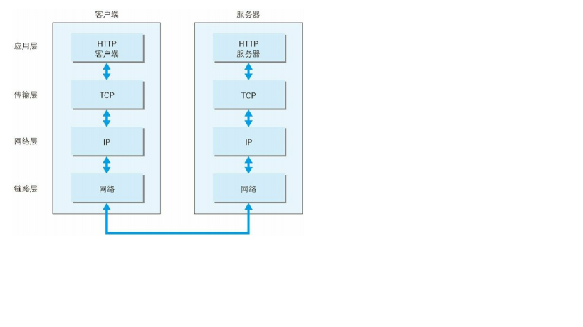

## TCP/IP协议族

1. 通常使用的网络是在TCP/IP协议族的基础上运行的，http属与其内部的一个子集。
2. 计算机与网络设备进行通信，需要基于相同的方法，所有的这一切都需要一种规则，这种规则被称为协议。
3. TCP/IP协议族按层次分为：应用层、传输层、网络层、数据链路层。
   1. 应用层决定了向用户提供应用服务时通信的活动，TCP/IP协议族内部预存了各类通用的应用服务。比如FPT（文件传输协议），DNS（域名系统）。HTTP协议也属于该层。
   2. 传输层对上层引用层提供处于网络连接中两台计算机之间的数据传输。传输层有两个性质不同的协议TCP（传输控制协议），UDP用户数据报协议。
   3. 网络层用来处理在网络上流动的数据包。数据包是网络传输的最小数据单位。该层规定了通过怎样的路径（传输线路）到达对方计算机，并把数据包传送给对方。与对方计算机之间通过多台计算机或网络设备进行传输时，网络层起的作用就是在众多选项内选择一条传输线路。
   4. 链路层（数据链路层、网络接口层）用来处理连接网络的硬件部分。包括控制操作系统、硬件的设备驱动。网卡，光纤等物理可见部分。硬件上的范畴均在链路层的作用范围之内。
   
    

