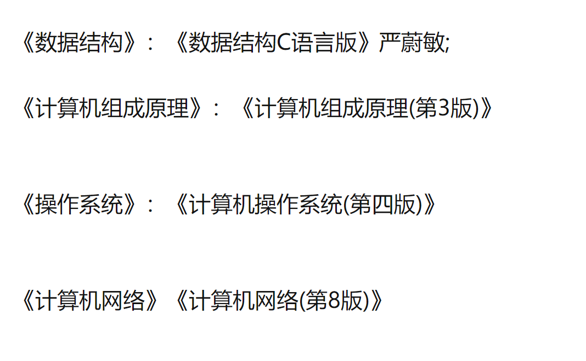
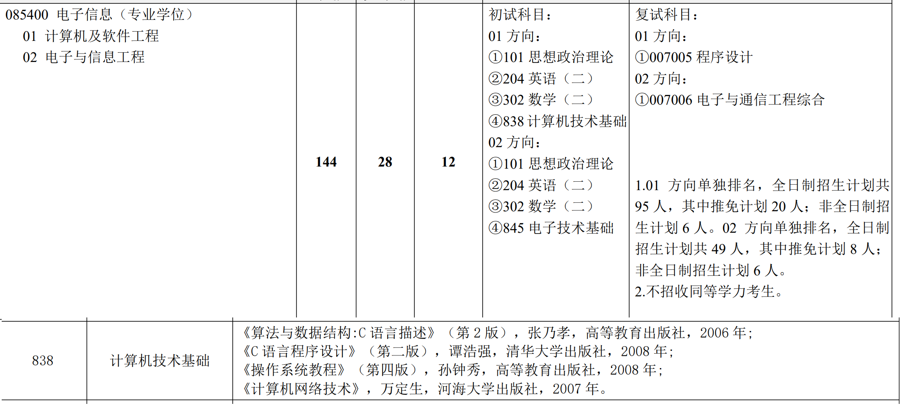
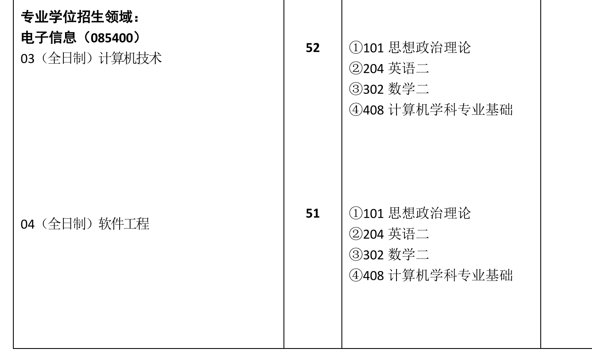
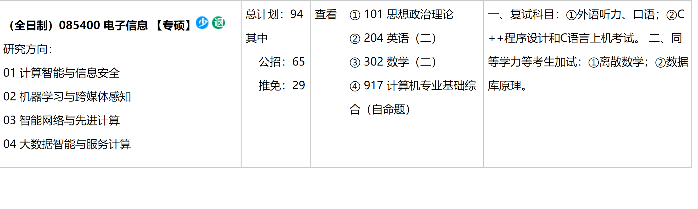

### 408

[408计算机学科专业基础综合到底考什么？](https://zhuanlan.zhihu.com/p/427757805)

### 848

Ⅲ特别推荐

\1. 严蔚敏，吴伟民, 数据结构（C 语言版）,清华大学出版社出版

\2. 严蔚敏, 吴伟民,《数据结构习题解析》,清华大学出版社出版

\3. 汤小丹，梁红兵，《计算机操作系统》，西安电子科技大学出版社

\4. 谭浩强，C程序设计，清华大学出版社

### 河海大学

### 武汉理工大学

### 厦门大学

| (131)计算机科学与技术系 | (081200)计算机科学与技术 | 全日制 | 25   | 无   |
| ----------------------- | ------------------------ | ------ | ---- | ---- |
| (131)计算机科学与技术系 | (085404)计算机技术       | 全日制 | 71   | 无   |

| 085404计算机技术                 | 01计算机视觉与图象处理 | (1)全日制                                            | 1.本专业计划仅供参考，我校有权对该计划进行相应调整。         | ①101思想政治理论②204英语（二）③302数学（二）④408计算机学科专业基础 |
| -------------------------------- | ---------------------- | ---------------------------------------------------- | ------------------------------------------------------------ | ------------------------------------------------------------ |
| 02数据库与数据挖掘技术           | (1)全日制              | 1.本专业计划仅供参考，我校有权对该计划进行相应调整。 | ①101思想政治理论②204英语（二）③302数学（二）④408计算机学科专业基础 |                                                              |
| 03计算机网络与信息安全           | (1)全日制              | 1.本专业计划仅供参考，我校有权对该计划进行相应调整。 | ①101思想政治理论②204英语（二）③302数学（二）④408计算机学科专业基础 |                                                              |
| 04云计算技术                     | (1)全日制              | 1.本专业计划仅供参考，我校有权对该计划进行相应调整。 | ①101思想政治理论②204英语（二）③302数学（二）④408计算机学科专业基础 |                                                              |
| 05大数据技术                     | (1)全日制              | 1.本专业计划仅供参考，我校有权对该计划进行相应调整。 | ①101思想政治理论②204英语（二）③302数学（二）④408计算机学科专业基础 |                                                              |
| 06数字医疗技术                   | (1)全日制              | 1.本专业计划仅供参考，我校有权对该计划进行相应调整。 | ①101思想政治理论②204英语（二）③302数学（二）④408计算机学科专业基础 |                                                              |
| 07移动计算与智能终端技术         | (1)全日制              | 1.本专业计划仅供参考，我校有权对该计划进行相应调整。 | ①101思想政治理论②204英语（二）③302数学（二）④408计算机学科专业基础 |                                                              |
| 08现代计算机体系结构与嵌入式应用 | (1)全日制              | 1.本专业计划仅供参考，我校有权对该计划进行相应调整。 | ①101思想政治理论②204英语（二）③302数学（二）④408计算机学科专业基础 |                                                              |
| 09多媒体与人机交互技术           | (1)全日制              | 1.本专业计划仅供参考，我校有权对该计划进行相应调整。 | ①101思想政治理论②204英语（二）③302数学（二）④408计算机学科专业基础 |                                                              |
| 10软件工程                       | (1)全日制              | 1.本专业计划仅供参考，我校有权对该计划进行相应调整。 | ①101思想政治理论②204英语（二）③302数学（二）④408计算机学科专业基础 |                                                              |
| 11机器智能与计算机控制技术       | (1)全日制              | 1.本专业计划仅供参考，我校有权对该计划进行相应调整。 | ①101思想政治理论②204英语（二）③302数学（二）④408计算机学科专业基础 |                                                              |
| 12空间感知与计算                 | (1)全日制              | 1.本专业计划仅供参考，我校有权对该计划进行相应调整。 | ①101思想政治理论②204英语（二）③302数学（二）④408计算机学科专业基础 |                                                              |
| 13图形学与增强现实               | (1)全日制              | 1.本专业计划仅供参考，我校有权对该计划进行相应调整。 | ①101思想政治理论②204英语（二）③302数学（二）④408计算机学科专业基础 |                                                              |
| 14生物计算与计算生物             | (1)全日制              | 1.本专业计划仅供参考，我校有权对该计划进行相应调整。 | ①101思想政治理论②204英语（二）③302数学（二）④408计算机学科专业基础 |                                                              |
| 15计算机视觉技术                 | (1)全日制              | 1.本专业计划仅供参考，我校有权对该计划进行相应调整。 | ①101思想政治理论②204英语（二）③302数学（二）④408计算机学科专业基础 |                                                              |
| 16智能诊疗技术                   | (1)全日制              | 1.本专业计划仅供参考，我校有权对该计划进行相应调整。 | ①101思想政治理论②204英语（二）③302数学（二）④408计算机学科专业基础 |                                                              |
| 17智能空间感知与计算             | (1)全日制              | 1.本专业计划仅供参考，我校有权对该计划进行相应调整。 | ①101思想政治理论②204英语（二）③302数学（二）④408计算机学科专业基础 |                                                              |
| 18大数据与智能计算技术           | (1)全日制              | 1.本专业计划仅供参考，我校有权对该计划进行相应调整。 | ①101思想政治理论②204英语（二）③302数学（二）④408计算机学科专业基础 |                                                              |
| 19并行与分布式处理               | (1)全日制              | 1.本专业计划仅供参考，我校有权对该计划进行相应调整。 | ①101思想政治理论②204英语（二）③302数学（二）④408计算机学科专业基础 |                                                              |

#### 南航

[南京航空航天大学科目考试大纲](http://yzsbm.nuaa.edu.cn/sskmdg/index.html)

[南京航空航天大学2022年招收攻读硕士学位研究生专业目录](http://yzsbm.nuaa.edu.cn/sszsml/index.html)

| 085400（专业学位）电子信息        | 136  | ①101思想政治理论②201英语（一）③302数学（二）④829计算机专业基础 |      | 复试科目：①541离散数学与编译原理 |
| --------------------------------- | ---- | :----------------------------------------------------------: | ---- | -------------------------------- |
| 01（全日制）网络与分布计算        |      |                                                              |      |                                  |
| 02（全日制） 图形学与图像处理技术 |      |                                                              |      |                                  |
| 03（全日制） 软件演化             |      |                                                              |      |                                  |
| 04（全日制） 网络与信息安全技术   |      |                                                              |      |                                  |
| 05（全日制） 人工智能与数据挖掘   |      |                                                              |      |                                  |
| 06（全日制）信息物理融合系统      |      |                                                              |      |                                  |
| 07（全日制）密码学                |      |                                                              |      |                                  |
| 08（全日制）嵌入式系统及物理安全  |      |                                                              |      |                                  |
| 09（全日制） 数据安全与数据库技术 |      |                                                              |      |                                  |
| 10（全日制）软件工程技术          |      |                                                              |      |                                  |
| 11（全日制）软件质量与系统安全    |      |                                                              |      |                                  |

### 重庆大学

[2022年硕士招生专业目录](http://yz.cqu.edu.cn/sszyml/2022/14.html)

[重庆大学重大计算机917考研考前指导By砍柴(KC)团队](https://zhuanlan.zhihu.com/p/343185591)

