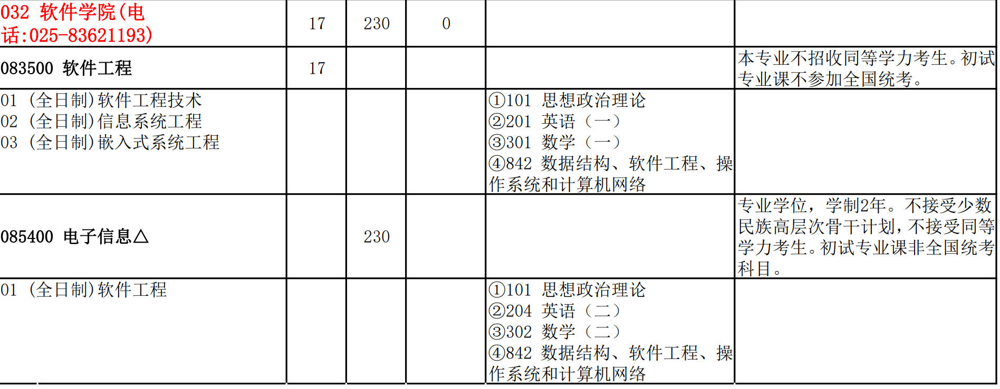
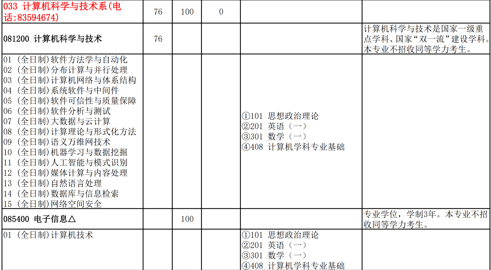
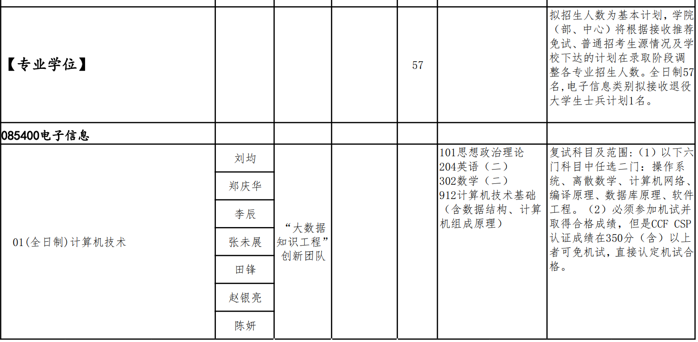
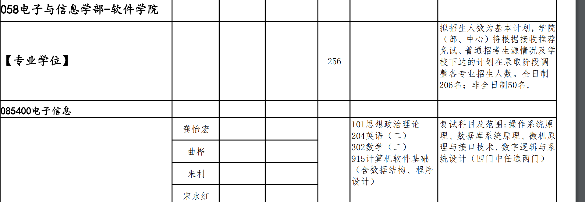
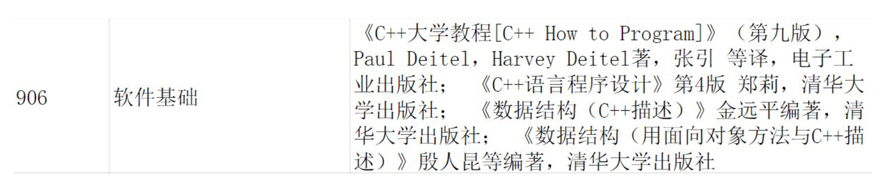

### 408

[408计算机学科专业基础综合到底考什么？](https://zhuanlan.zhihu.com/p/427757805)

### 848

Ⅲ特别推荐

\1. 严蔚敏，吴伟民, 数据结构（C 语言版）,清华大学出版社出版

\2. 严蔚敏, 吴伟民,《数据结构习题解析》,清华大学出版社出版

\3. 汤小丹，梁红兵，《计算机操作系统》，西安电子科技大学出版社

\4. 谭浩强，C程序设计，清华大学出版社

### 河海大学

### 武汉理工大学

### 厦门大学

| (131)计算机科学与技术系 | (081200)计算机科学与技术 | 全日制 | 25   | 无   |
| ----------------------- | ------------------------ | ------ | ---- | ---- |
| (131)计算机科学与技术系 | (085404)计算机技术       | 全日制 | 71   | 无   |

| 085404计算机技术                 | 01计算机视觉与图象处理 | (1)全日制                                            | 1.本专业计划仅供参考，我校有权对该计划进行相应调整。         | ①101思想政治理论②204英语（二）③302数学（二）④408计算机学科专业基础 |
| -------------------------------- | ---------------------- | ---------------------------------------------------- | ------------------------------------------------------------ | ------------------------------------------------------------ |
| 02数据库与数据挖掘技术           | (1)全日制              | 1.本专业计划仅供参考，我校有权对该计划进行相应调整。 | ①101思想政治理论②204英语（二）③302数学（二）④408计算机学科专业基础 |                                                              |
| 03计算机网络与信息安全           | (1)全日制              | 1.本专业计划仅供参考，我校有权对该计划进行相应调整。 | ①101思想政治理论②204英语（二）③302数学（二）④408计算机学科专业基础 |                                                              |
| 04云计算技术                     | (1)全日制              | 1.本专业计划仅供参考，我校有权对该计划进行相应调整。 | ①101思想政治理论②204英语（二）③302数学（二）④408计算机学科专业基础 |                                                              |
| 05大数据技术                     | (1)全日制              | 1.本专业计划仅供参考，我校有权对该计划进行相应调整。 | ①101思想政治理论②204英语（二）③302数学（二）④408计算机学科专业基础 |                                                              |
| 06数字医疗技术                   | (1)全日制              | 1.本专业计划仅供参考，我校有权对该计划进行相应调整。 | ①101思想政治理论②204英语（二）③302数学（二）④408计算机学科专业基础 |                                                              |
| 07移动计算与智能终端技术         | (1)全日制              | 1.本专业计划仅供参考，我校有权对该计划进行相应调整。 | ①101思想政治理论②204英语（二）③302数学（二）④408计算机学科专业基础 |                                                              |
| 08现代计算机体系结构与嵌入式应用 | (1)全日制              | 1.本专业计划仅供参考，我校有权对该计划进行相应调整。 | ①101思想政治理论②204英语（二）③302数学（二）④408计算机学科专业基础 |                                                              |
| 09多媒体与人机交互技术           | (1)全日制              | 1.本专业计划仅供参考，我校有权对该计划进行相应调整。 | ①101思想政治理论②204英语（二）③302数学（二）④408计算机学科专业基础 |                                                              |
| 10软件工程                       | (1)全日制              | 1.本专业计划仅供参考，我校有权对该计划进行相应调整。 | ①101思想政治理论②204英语（二）③302数学（二）④408计算机学科专业基础 |                                                              |
| 11机器智能与计算机控制技术       | (1)全日制              | 1.本专业计划仅供参考，我校有权对该计划进行相应调整。 | ①101思想政治理论②204英语（二）③302数学（二）④408计算机学科专业基础 |                                                              |
| 12空间感知与计算                 | (1)全日制              | 1.本专业计划仅供参考，我校有权对该计划进行相应调整。 | ①101思想政治理论②204英语（二）③302数学（二）④408计算机学科专业基础 |                                                              |
| 13图形学与增强现实               | (1)全日制              | 1.本专业计划仅供参考，我校有权对该计划进行相应调整。 | ①101思想政治理论②204英语（二）③302数学（二）④408计算机学科专业基础 |                                                              |
| 14生物计算与计算生物             | (1)全日制              | 1.本专业计划仅供参考，我校有权对该计划进行相应调整。 | ①101思想政治理论②204英语（二）③302数学（二）④408计算机学科专业基础 |                                                              |
| 15计算机视觉技术                 | (1)全日制              | 1.本专业计划仅供参考，我校有权对该计划进行相应调整。 | ①101思想政治理论②204英语（二）③302数学（二）④408计算机学科专业基础 |                                                              |
| 16智能诊疗技术                   | (1)全日制              | 1.本专业计划仅供参考，我校有权对该计划进行相应调整。 | ①101思想政治理论②204英语（二）③302数学（二）④408计算机学科专业基础 |                                                              |
| 17智能空间感知与计算             | (1)全日制              | 1.本专业计划仅供参考，我校有权对该计划进行相应调整。 | ①101思想政治理论②204英语（二）③302数学（二）④408计算机学科专业基础 |                                                              |
| 18大数据与智能计算技术           | (1)全日制              | 1.本专业计划仅供参考，我校有权对该计划进行相应调整。 | ①101思想政治理论②204英语（二）③302数学（二）④408计算机学科专业基础 |                                                              |
| 19并行与分布式处理               | (1)全日制              | 1.本专业计划仅供参考，我校有权对该计划进行相应调整。 | ①101思想政治理论②204英语（二）③302数学（二）④408计算机学科专业基础 |                                                              |

### 南航

[南京航空航天大学科目考试大纲](http://yzsbm.nuaa.edu.cn/sskmdg/index.html)

[南京航空航天大学2022年招收攻读硕士学位研究生专业目录](http://yzsbm.nuaa.edu.cn/sszsml/index.html)

| 085400（专业学位）电子信息        | 136  | ①101思想政治理论②201英语（一）③302数学（二）④829计算机专业基础 |      | 复试科目：①541离散数学与编译原理 |
| --------------------------------- | ---- | :----------------------------------------------------------: | ---- | -------------------------------- |
| 01（全日制）网络与分布计算        |      |                                                              |      |                                  |
| 02（全日制） 图形学与图像处理技术 |      |                                                              |      |                                  |
| 03（全日制） 软件演化             |      |                                                              |      |                                  |
| 04（全日制） 网络与信息安全技术   |      |                                                              |      |                                  |
| 05（全日制） 人工智能与数据挖掘   |      |                                                              |      |                                  |
| 06（全日制）信息物理融合系统      |      |                                                              |      |                                  |
| 07（全日制）密码学                |      |                                                              |      |                                  |
| 08（全日制）嵌入式系统及物理安全  |      |                                                              |      |                                  |
| 09（全日制） 数据安全与数据库技术 |      |                                                              |      |                                  |
| 10（全日制）软件工程技术          |      |                                                              |      |                                  |
| 11（全日制）软件质量与系统安全    |      |                                                              |      |                                  |

### 重庆大学

[2022年硕士招生专业目录](http://yz.cqu.edu.cn/sszyml/2022/14.html)

[重庆大学重大计算机917考研考前指导By砍柴(KC)团队](https://zhuanlan.zhihu.com/p/343185591)

### 南京大学

https://zhuanlan.zhihu.com/p/544560354

专业课：842（数据结构，操作系统，软件工程，计算机网络）

前期用两个多月打基础，每科都入门以后根据考试题来把握复习重点，之后再巩固自命题特色的知识，最后用考题给自己查漏补缺一下。四科的复习时间也是时有重叠的，这样避免学一科忘一科。希望你能够制定出适合你自己的学习规划，自己的规划也是要根据学习程度适时调整的。842考试的科目比较多，我就分科目说了。我的复习资料是在计算机研部落找到的，常用的gou物网站都可以找到。一般建议从数据结构开始复习，也可以先看软件工程。

1、软件工程（45分）

复习资料：软件工程与计算II（骆斌主编）+南软PPT

如果没有软工的相关基础，它是不太容易看明白的，建议先攻克软工，建议先花两三周过一遍课本大致对软工有个了解，然后看一下近几年的考研真题把握一下出题方向。然后对着PPT看课本，重点章节多看看多思考（课本目录部分“第四部分 软件设计”，尤其是12-16章），PPT上的例题要反复看会并掌握。软工的设计模式基本也是Java设计模式的原题，会考的设计模式也就5种，勤快就好。软工是一定有25分的背诵的，建议十月初就开始背诵，我直接背的找的资料，软工部分很多但很全，最好全背，我是在计算机研部落找到的。

2、数据结构（45分）

复习资料：王道数据结构、南软本科PPT。

数据结构的考研题大部分都是南软本科习题课PPT上的内容，用半个多月的时间先把这部分看完，再用过王道书，并把王道上的习题写一遍，尤其注意递归题，南软非常喜欢递归，毕竟递归代码简洁适合出题，王道上的代码题我记得大多也都是递归，可能比南软本科PPT上的代码题难些，但建议把王道上的看会（20年那个双指针判环就是王道上有 南软PPT上没有），基本上一个多月代码基本看全了。南软历年真题中的非代码类题目有很多重复，视为重点知识点重点掌握。

3、C操作系统（35分）

复习资料：王道操作系统+操作系统教程第五版（费翔林 骆斌主编）+南软PPT

我比较喜欢王道的边讲解边做题的模式，用半个多月的时间，把王道先过一遍，并选择性的做些课后题，然后再看本科的PPT。课本知识点讲得比王道讲的清楚，所以有不明白的地方就翻课本（如果课本你能看下去，强烈建议多看几遍课本）。考试内容基本上PPT上都有，历年考题里的固定题型要会做，举一即可反三；PV多练练（官方书课后习题和王道的题目），10月的时候花一两周的时间攻克下来，再时常拿题练练，别忘了；然后近两年考的记忆性的知识多了，所以PPT上的知识点要理解性记忆，从考题中找需要掌握的重点。

4、计算机网络（25分）

复习资料：王道计算机网络+南软PPT（视情况看）

首先计网是肯定离不开背诵的。先花半个月的时间王道看完，选择性做做课后题里的选择题来帮助理解。然后就是背诵！历年题目中出现过的知识点及其相关知识背会；历年题目出现过的计算大题理解会做（以防万一出计算题）；南大喜欢考自己的东西，南软ppt上的内容还是要背！

842的特征是很明显的，就是背的多，往年考的的知识点仍有概率会再考，这里就可见真题的重要性。十一月开始正式做期末题真题（不会的翻书学），背名词解释，巩固代码题。往年考过的知识及其相关内容都要复习到位，防止试卷出其不意。

### 西交

**2.西交软件工程考研考什么科目，参考书目是？**

**考研数学（二）+计算机软件基础（专业代号：915）+英语（二）+政治。**

ps：考研中数学有三类，数学一、数学二、数学三，西交软件考的是数学二。

计算机软件基础（915）：考试内容为《数据结构》（70%）+《C语言程序设计》（30%）。

《数据结构》参考书目：《数据结构（第二版）》 清华大学出版社 1992年6月 严蔚敏 第二版

《程序设计与C语言》参考书目：《程序设计与C语言》 西安交通大学出版社 2005年8月 梁力 第二版

### 华东理工大学

#### 815《计算机专业基础综合》硕士研究生入学考试

包括数据结构、计算机组成原理、操作系统三大块内容，各占1/3。

考试大纲：

一.数据结构：1.数据结构的基本概念，算法及其特征，算法的简单分析与时间/空间复杂度。2.线性表的概念特征及的实现。3.栈和队列的概念特征及实现，递归。4.多维数组与存储。5.二叉树的性质及实现，线索二叉树，二叉排序树，平衡二叉树，哈夫曼树，堆的建立，插入和删除算法的实现。6.树与森林的概念，存储及操作算法，B树，B+树的定义及操作的实现。7.图的概念，存储表示，操作及应用的实现。8.查找的概念及典型查找算法的实现，哈希表。9.排序的概念及典型排序算法的实现。

二.计算机组成原理：1. 计算机概要与技术:程序概念入门；硬件概念入门；性能和功耗；性能的测试方法，Amdahl定律。2. 指令：计算机的语言；操作码的编制方式；计算机的操作数，不同的寻址方式；各种指令的基本格式以及原理，计算机硬件对过程的支持；基本的MIPS指令集体系结构。3．计算机的算术运算：计算机加减乘除法运算。浮点数表示，IEEE754标准，浮点运算。4．处理器：数据通路的概念以及建立数据通路的思想；流水线概述；流水线数据通路及其控制；结构冒险、数据冒险、控制冒险；数据冒险的转发与阻塞；控制冒险中假设分支不发生、缩短分支的延迟、动态分支预测的思想与实现方法。5．存储器的层次结构：大容量存储器的层次结构；cache的基本原理；cache的性能评估与改进。虚拟存储器；集成虚拟存储器、快表和cache。虚拟存储器、cache、内存数据一致性问题。6．存储系统和其他I/O主题：可信度、可靠性和可用性；磁盘存储器；flash；处理器、内存及I/O设备的连接。

三.操作系统：1.操作系统的概念、特征、功能和提供的服务。2.进程与线程，处理机调度，进程同步与互斥(信号量机制，经典同步问题)，死锁(系统安全状态，银行家算法)。3.内存管理(分页管理方式，分段管理方式)，虚拟内存管理(请求分页管理方式，页面置换算法)。4.文件管理，设备管理，磁盘组织与管理(磁盘调度算法)。

| 085404计算机技术 | 全日制 | 01人工智能 02可信软件与系统 03数据分析与应用 04媒体计算 05网络与信息工程 06工业软件 | 68     | ①101思想政治理论②204英语（二）③302数学（二）④815计算机专业基础综合 |
| ---------------- | ------ | ------------------------------------------------------------ | ------ | ------------------------------------------------------------ |
|                  |        |                                                              | 推免34 |                                                              |

## 东南大学

| 401 软件学院（苏州）       | 192  |                                                              |                                                              |                                              |
| -------------------------- | ---- | ------------------------------------------------------------ | ------------------------------------------------------------ | -------------------------------------------- |
| 085400（专业学位）电子信息 |      | 01（全日制）方向：  ①101思想政治理论  ②201英语（一）  ③302数学（二）  ④906软件基础  02（全日制）方向：  ①101思想政治理论  ②201英语（一）  ③302数学（二）  ④934电路 |                                                              | 复试科目：①5c5自动控制原理或②5d4软件工程综合 |
| 01（全日制）软件工程       |      |                                                              | 培养地点：苏州。01方向初试906（考试大纲见：https://cose.seu.edu.cn/18033/list.htm），复试5d4（包括软件工程基础、计算机网络、数据库原理）;02方向初试934，复试5c5。 |                                              |
| 02（全日制）人工智能应用   |      |                                                              |                                                              |                                              |

**院系代码****院系名称****专业代码****专业名称****学习方式****考试人数****总录取数****推免录取数****统考录取数**

| 401  | 软件学院（苏州） | 085400 | 电子信息(专业学位) | 全日制 | 496  | 309  | 35   | 274  |
| ---- | ---------------- | ------ | ------------------ | ------ | ---- | ---- | ---- | ---- |
|      |                  |        |                    |        |      |      |      |      |

https://zhuanlan.zhihu.com/p/507655022

