## 函数、图像和直线

### 常见函数图像

#### 多项式

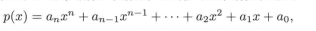
$$
a_n , a_{n-1}为多项式基本项的系数，最高项的系数为首项系数对应的是上面的a_n最大的幂指数n为多项式的次数。
$$
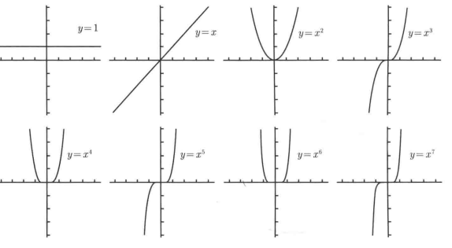

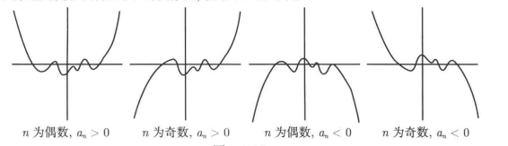

##### 二次函数

项式次数为2的多项式，有以下特性。
$$
\Delta = b^2 - 4ac 小于0无实根，等于0有一个实根（两个相同解），大于0有两个不同实根
$$

$$
求根公式  {-b\pm \sqrt {b^2 - 4ac} \over 2a}
$$

配方

$$
{(a-b)^2 = a^2 - 2ab + b^2}    
$$

$$
{(a+b)^2 = a^2 + 2ab + b^2}
$$

 

#### 有理函数

形如$p(x)\over q(x)$其中p和q为多项式的函数，叫做有理函数。

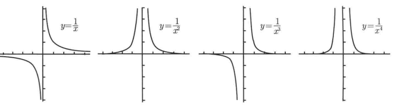

#### 指数函数和对数函数

指数函数：$y=2^x$

对数函数：$y=\log_{2}{x}$

指数函数和对数函数互为反函数。

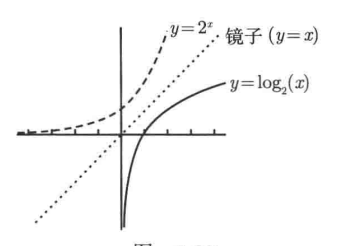

## 三角函数

### 基本知识

正弦$sinx$对边比斜边，余割$cscx={1\over sinx}$斜边比对边。

余弦$cosx$邻边比斜边，正割$secx={1\over cosx}$斜边比邻边。

正切$tanx$对比比邻边，余切$cont={1\over tanx}$邻边比对边。

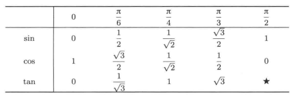

### 三角函数的图像

$sinx$的图像以$2π$为周期，是一个奇函数。

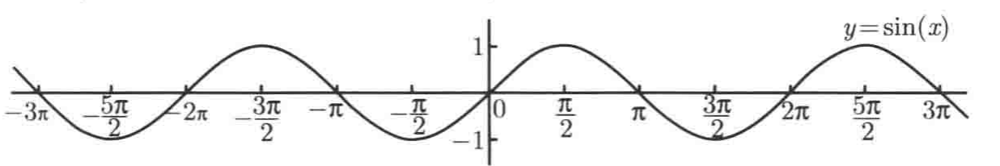

$cosx$的图像以$2π$为周期，是一个偶函数。

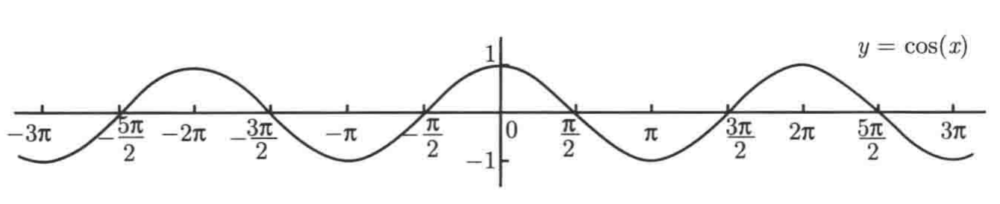

$tanx$图像以$π$为周期，在$π \over 2$和$-{π \over 2}$处存在一条垂直渐近线，是一个奇函数。

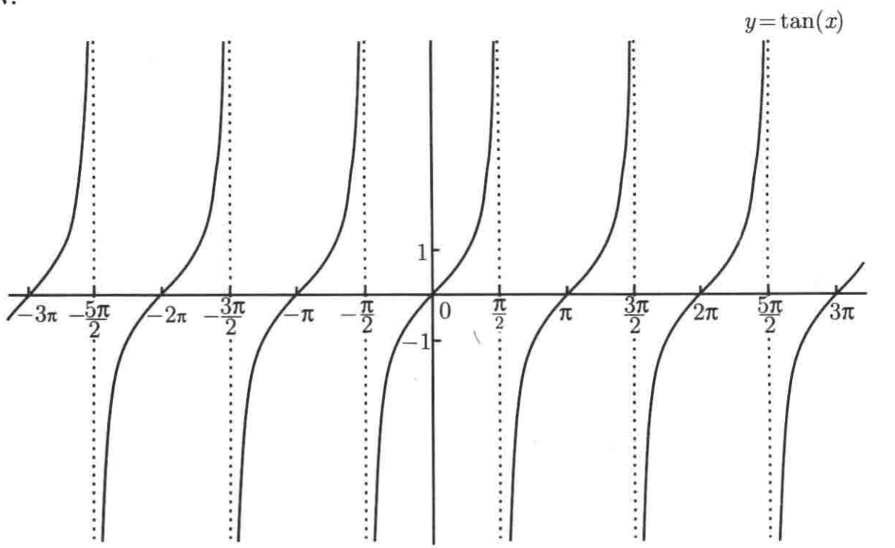

$cscx$图像以$2π$为周期，在$0$和${π}$处存在一条垂直渐近线，是一个奇函数。

$cotx$图像以为π周期，在$0$和${π}$处存在一条垂直渐近线，是一个奇函数。

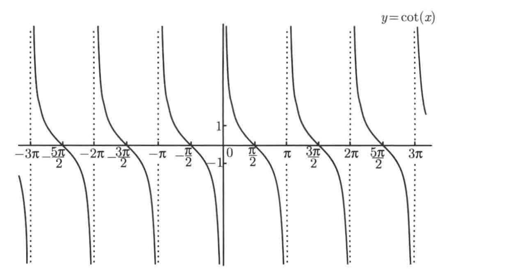

$secx$图像以$2π$为周期，在$π \over 2$和$-{π \over 2}$处存在一条垂直渐近线，是一个偶函数。

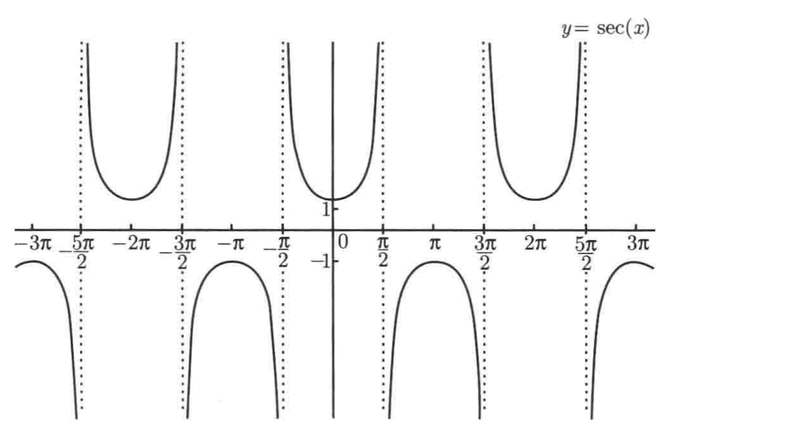

### 三角恒等式

$tan(x) = {sin(x) \over cos(x)}$ => $cot(x) = {cos(x)\over sin(x)}$

$sin^2(x) + cosx^2(x) = 1$ 两边同时除以 $cos^2(x)$ =>  $ 1+tan^2(x)  = sec^2(x)$

$sin^2(x) + cosx^2(x) = 1$ 两边同时除以 $sin^2(x)$ =>  $1 + cot^2(x) = csc^2(x)$

某个角的余角是该角与$π\over2$的差（该角与余角的和为$π\over2$），因为余角的余角就是原始角，对于带有co（互余）的三角函数有以下

$sin(x) = cos({π\over2} - x)$ => $cos(x) = sin({π\over2} - x)$

$tan(x) = cot({π\over2} - x)$ => $cot(x) = tan({π\over2} - x)$

$sec(x) = csc({π\over2}-x)$ => $csc(x) =sec({π\over2} - x)$

$sin(x+y) = sin(x)cos(y) + cos(x)sin(y)$ => $sin(2x) = 2sin(x)cos(x)$

$sin(x-y) = sin(x)cos(y) - cos(x)sin(y)$ => $sin(2x) = 2sin(x)cos(x)$

$cos(x+y) = cos(x)cos(y) - sin(x)sin(y)$ => $cos(2x) = 1- 2sin^2(x)$ = $2cos^2(x) -1$

$cos(x-y) = cos(x)cos(y) + sin(x)sin(y)$

## 极限导论

$\lim_{x \rightarrow 2}f(x) = 1$ 当x趋近于2时，f(x)的极限等于1，x永远不能等于2，且x=2无意义，所以x只是一个虚拟变量，只是一个暂时的标记，它可以是任意字母。

### 左极限和右极限

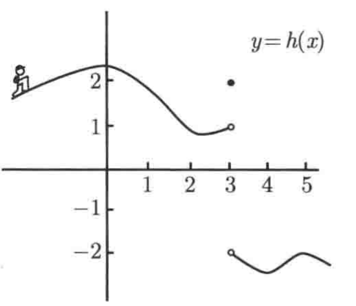

上图可以看出，x从左侧接近3时，f(x)趋于1，所以h(x)在x=3处的左极限等于1。

x从右侧接近3时，f(x)趋于-2，所以h(x)在x=3处的右极限等于-2。

可得

$\large lim_{x \rightarrow {3-}}h(x) = 1$

$\large lim_{x \rightarrow {3+}}h(x) = -2$

双侧极限存在的前提是，左右极限存在且相等。

$\large lim_{x \rightarrow {a+}}f(x) = L  且  lim_{x \rightarrow {a-}}f(x) = L  等价于  large lim_{x \rightarrow {a}}f(x) = L$

### 极限不存在

针对$\large f(x) = {1\over x}$

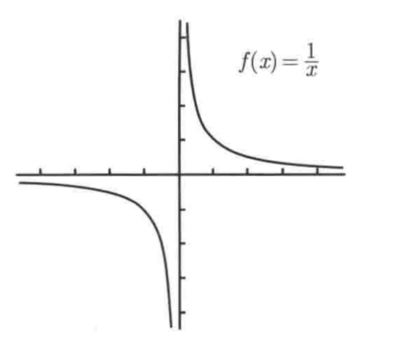

$\large lim_{x \rightarrow {0+}}{1\over x} = +\infty$   而    $\large lim_{x \rightarrow {0+}}{1\over x} = -\infty$

左右极限不相等所以双侧极限不存在。

而针对$\large f(x) = {1\over x^2}$

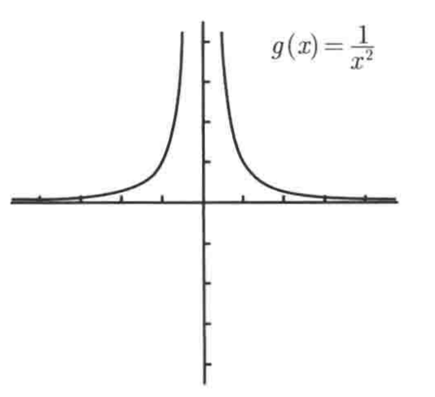

$\large lim_{x \rightarrow {0+}}{1\over x} = +\infty$   而    $\large lim_{x \rightarrow {0+}}{1\over x} = +\infty$

左右极限相等所以存在双侧极限，  $\large lim_{x \rightarrow {0}}{1\over x^2} = \infty$

因为上面两个函数在$x=0$处有一条垂直渐近线，所以若$\large f在x=a$处有一条垂直渐近线，则

$\large lim_{x \rightarrow {a+}}f(x)$   和    $\large lim_{x \rightarrow {0+}}f(x)$其中至少有一个极限是$\large +\infty 或 -\infty$。

### 在$\infty 和 -\infty$处的极限

若$\large f(x)在 y = L处有一条右侧水平渐近线则意味着 lim_{x\rightarrow \infin} = L$

若$\large f(x)在 y = L处有一条左侧水平渐近线则意味着 lim_{x\rightarrow -\infin} = L$

$\large 因为f(x) = x^2的图像在x趋于\infin 和 -\infin 时没有水平渐近线，y只会越来越大 所以 lim_{x\rightarrow \infin}x^2 = \infin $

$\large 因为f(x) = sin(x)的图像只会在-1和1之间来回震荡，lim_{x\rightarrow \infin}sin(x) 不存在。$

$\large 因为 sin(x)为奇函数，所以可由sin({1\over x}) 的 x>0时的图像得到x<0时的图像,最终得出g(x) = {1\over x}的图像$

对于$\large g(x) = sin({1\over x})的图像 可得出 lim_{x\rightarrow \infin}sin({1\over x}) = 0  $

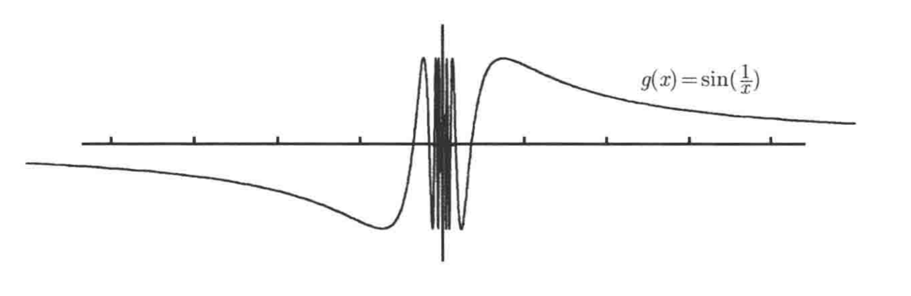

### 三明治定理（夹逼定理）

$\large 定义：如果一个函数f被夹在函数g和h之间，当x \rightarrow a时，g和h都收敛于一个极限L，则f也收敛于极限L$

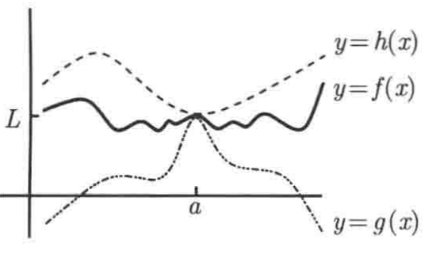
$$
\large 夹逼定理：对于所有在a附近的x都有g(x)<f(x)<h(x)，且lim_{x\rightarrow a}g(x) = L =lim_{x\rightarrow a}h(x) = L,则且lim_{x\rightarrow a}f(x) = L
$$
例1：证明$\large f(x) = xsin({1\over x}),lim_{x\rightarrow 0+}f(x) = 0$
$$
\because -1<sin({1\over x})<1  \\
\therefore -x<xsin({1\over x})<-x \\
\because lim_{x\rightarrow 0+}(-x) = 0,lim_{x\rightarrow 0+}(x) = 0
\therefore g(x) = -x 和 h(x) = x 在 x趋于0时均收敛于0 \\
\therefore f(x) = xsin({1\over x}), lim_{x\rightarrow 0+}f(x) = 0
$$
例2：证明$\large f(x) = {sin(x)\over {x}},lim_{x\rightarrow \infin}f(x) = 0$
$$
\because -1<sin(x)<1  \\
\therefore -{{1\over x}}<{sin(x)\over x}<{{1\over x}} \\
\because lim_{x\rightarrow \infin}(-{{1\over x}}) = 0,lim_{x\rightarrow \infin}({{1\over x}}) = 0
\therefore g(x) = -{{1\over x}} 和 h(x) = {{1\over x}} 在 x趋于\infin时均收敛于0 \\
\therefore f(x) = {sin(x)\over {x}}, lim_{x\rightarrow 0+}f(x) = 0
$$

### 极限基本类型

##### $x\rightarrow a时的右极限$

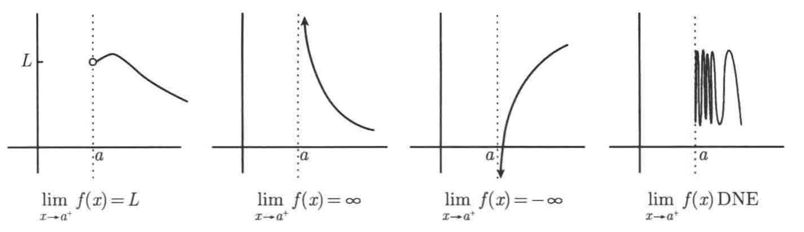

##### $x\rightarrow a时的左极限$

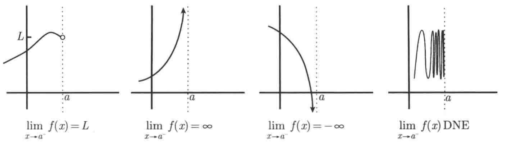

##### $x\rightarrow a时的双侧极限$

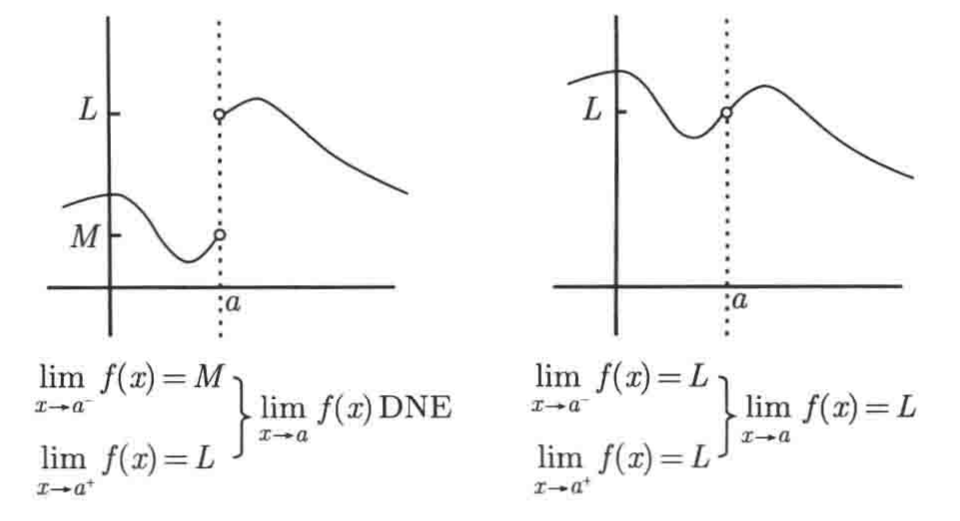

##### $x\rightarrow \infin时的极限$

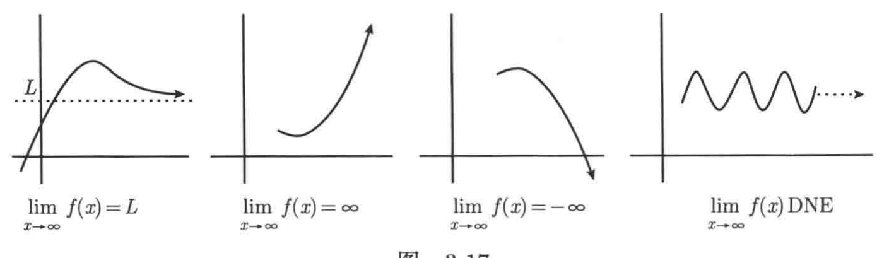

##### $x\rightarrow -\infin时的极限$

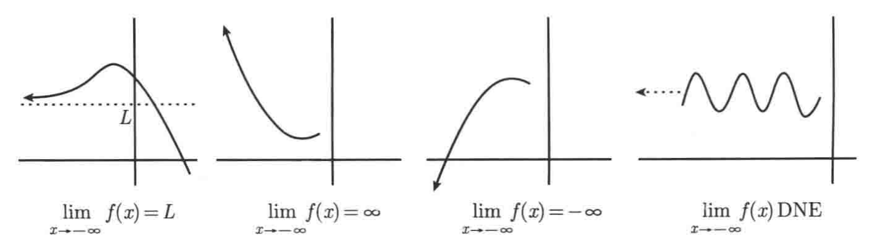

## 求解多项式的极限问题

### 因式分解

$\large (a+b)^2 = a^2 + 2ab + b^2\\ \large (a-b)^2 = a^2-2ab + b^2$

$\large (a-b)(a+b) = a^2 - b^2$

立方差公式

$\large (a-b)^3 = (a-b)(a^2 + ab + b^2)$ 

### $x\rightarrow a时有理函数的极限$

$\large lim_{x\rightarrow a}{p(x)\over{q(x)}}为有理函数,其中p，q为多项式，且a为一个有限的数。$

#### 直接带入求极限

$\large 求lim_{x\rightarrow -1}{x^2-3x+2\over{x-2}}的极限，可以直接带入x=-1,求出极限为-2。$

#### 因式分解求极限

利用平方差公式

$\large 求lim_{x\rightarrow 2}{x^2-3x+2\over{x-2}}的极限。将{x^2-3x+2}分解为(x-2)(x-3)化简得x-3,再带入x=2，求出极限为1。$

利用立方差公式

$\large 求lim_{x\rightarrow 3}{x^3-27\over{x^4 -5x^3 + 6x^2}}的极限。$

$\large \because x^3 - 27 = (x-3)(x^2 + 3x + 9) \\ \large \because x^4 - 5x^3 + 6x^2 = x^2(x^2 - 5x + 6) = x^2(x-2)(x-3)$

$\large \therefore lim_{x\rightarrow 3}{x^3-27\over{x^4 -5x^3 + 6x^2}} = {{(x^2 + 3x + 9)}\over {x^2(x-2)}} \\ \large \therefore 代入x = 3，lim_{x\rightarrow 3}{x^3-27\over{x^4 -5x^3 + 6x^2}} = 3 $

#### $x\rightarrow a时且分子不为0分母为0的有理函数的极限有四种情况$

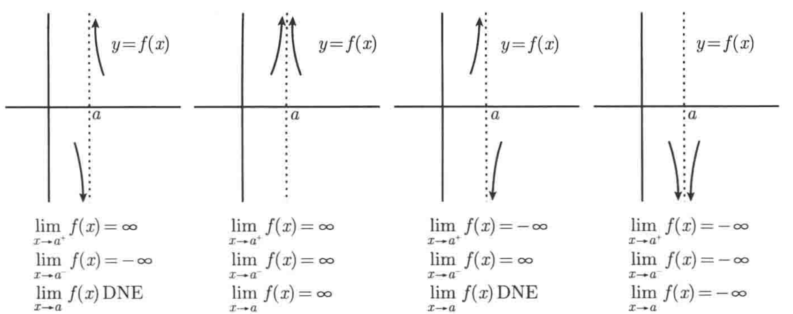

$\large 解决方法为代入 x=a，比较x微微向a左侧和右侧移动一点时，分子分母的比值的正负情况，\\ \large 均为正则为第二种情况，均为负则为第四种情况，负正为第一种情况，正负为第三种情况。$

$\large 例：求 lim_{x \rightarrow 1}{2x^2 -x -6 \over {x(x-1)^2}}的极限。$

$解：代入x=1，为 {-5\over {1*(x-1)^2}}，当x微微向1左侧右侧移动一点时时分子均为(-),分母为(+)(+)，\\ \therefore {(-)\over {(+)(+)}} = (-)即左右极限均为-\infin \therefore lim_{x \rightarrow 1}{2x^2 -x -6 \over {x(x-1)^2}} = -\infin $

### $x\rightarrow a时平方根的极限$

解法：分子分母同乘其共轭表达式即 $(a-b)(a+b) = a^2 - b^2$

$\large 例：求lim_{x\rightarrow 5}{{\sqrt{x^2-9}}-4\over x-5}$

$解；分子分母同乘\sqrt{x^2-9}+4，得到 {x^2 - 25\over{x-5 * (\sqrt{x^2-9}+4)}}={(x-5) * (x+5)\over{x-5 * (\sqrt{x^2-9}+4)}} \\ \large = {(x+5)\over{(\sqrt{x^2-9}+4)}}$

$\large 代入x=5，则lim_{x\rightarrow 5}{{\sqrt{x^2-9}}-4\over x-5} = {5\over 4}$

​	

