# 操作系统学习

# 第一章
## 1.1 操作系统的概念、功能
### 操作系统的概念
**操作系统（Operating System）是指控制和管理整个计算机系统的硬件和软件资源，并合理地组织调度计算机的工作和资源的分配；以提供给用户和其他软件方便的接口和环境；它是计算机系统中最基本的系统软件。**
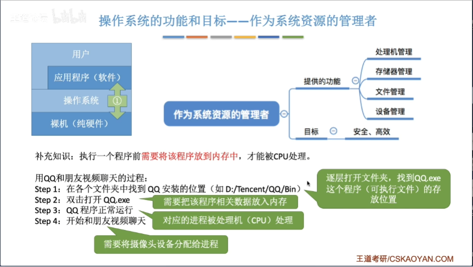
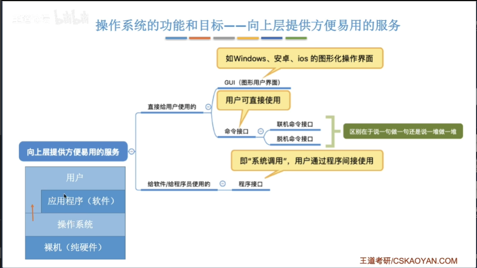
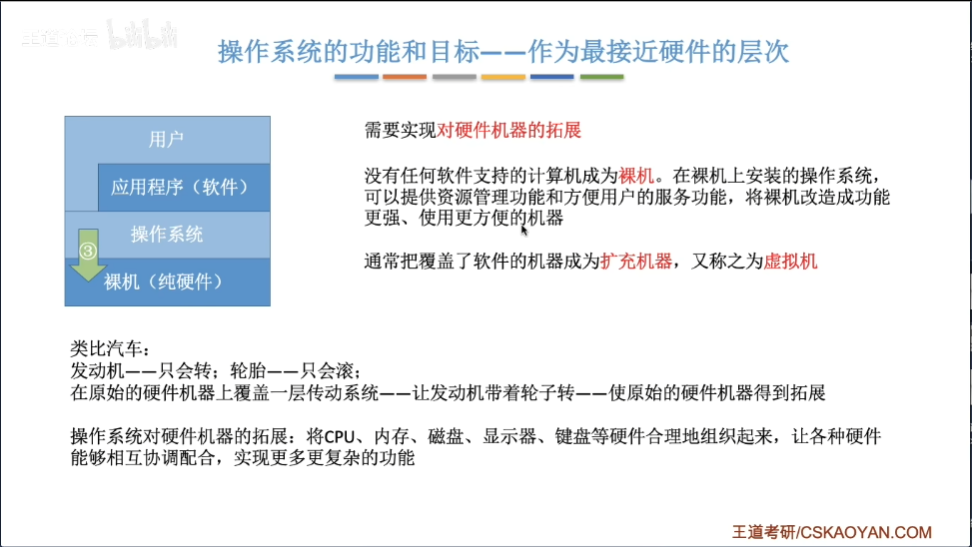
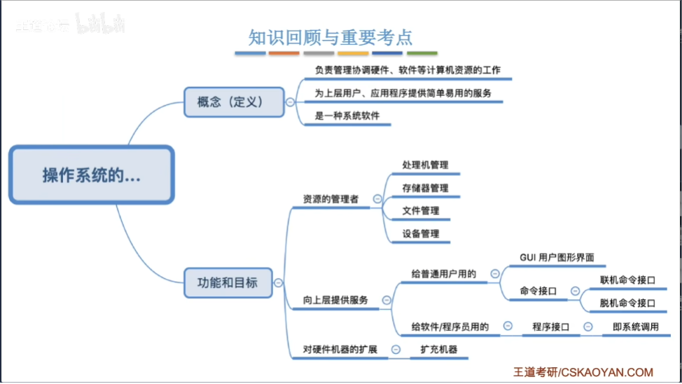

## 1.2 操作系统的特征

**两大基本特征：并发和共享**
### 并发和并行
并行是指同一时刻能完成两种或两种以上的工作。
并发是指两个或多个事件在同一时间间隔内发生。
**单核CPU同一时刻只能执行一个程序，各个程序只能并发地执行**
**多核CPU同一时刻可以同时执行多个程序，多个程序可以并行的执行**
### 共享
- 互斥共享方式：系统中的某些资源，虽然可以提供给多个进程使用，但同一时间段内只允许一个进程访问该资源，比如QQ和微信视频，摄像头资源只能分配给一个进程。
- 同时共享方式：系统中的某些资源，允许一个时间段内多个进程同时对它们进行访问，比如用QQ发文件给A，同时用微信发文件给B，从微观上两个进程是交替访问硬盘的

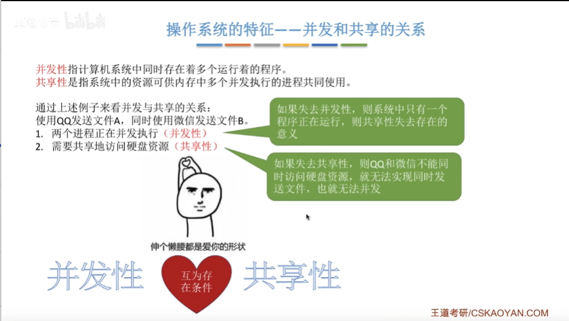

### 虚拟
**虚拟是指把一个物理上的实体变为若干个逻辑上的对应物。物理实体（前者）是实际存在的，而逻辑上对应物（后者）是用户感受到的**
**一个程序需要放入内存并给它分配CPU才能执行**
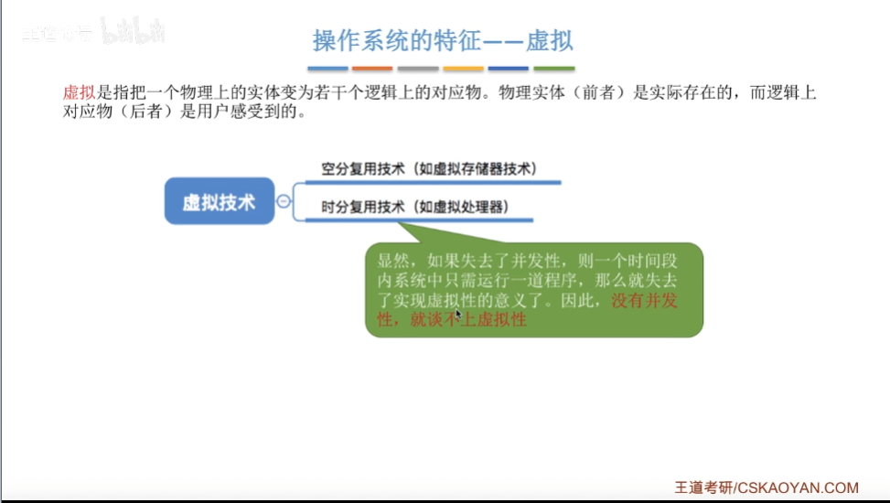

### 异步性
**多道程序环境允许多个程序并发执行，但由于资源有限，进程的执行并不是一贯到底的，而是走走停停，它以不可预知的速度向前推进**
### 总结 1
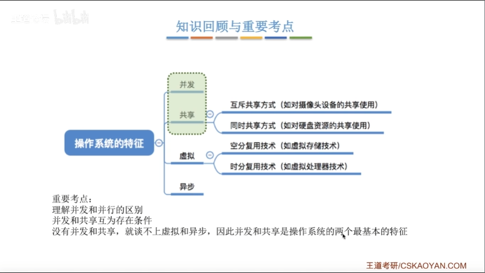

## 1.3 操作系统的发展与分类
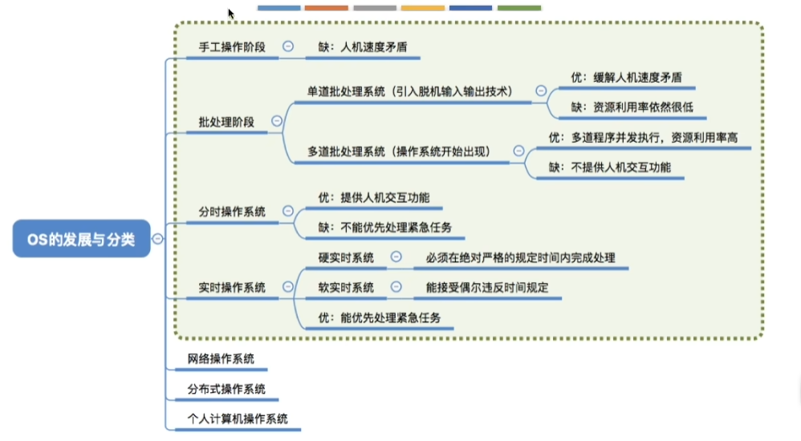

## 1.4 操作系统的运行机制

### 1.4.1 操作系统运行模式
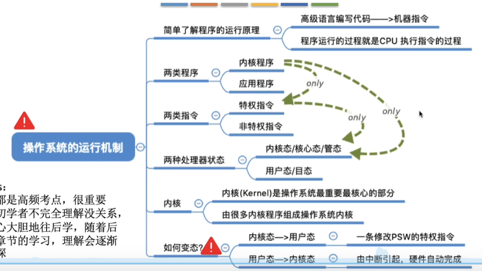

### 1.4.2 中断和异常

**"中断"是让操作系统内核夺回CPU使用权的唯一途径，"中断"会让CPU由用户态转变为内核态**

#### 中断的类型

- 内中断：与当前执行的指令有关，中断信号来自CPU内部
  - 例：试图在用户态下执行特权指令
  - 例：执行除法指令时发现除数为0
  - 例：应用程序想请求操作系统内核的服务，此时会执行一条特殊指令“陷入指令”，该指令会引发内部中断信号
- 外中断：与当前执行的指令无关，中断信号来自CPU外部
  - 例：时钟中断，由时钟部件发来的中断信号
  - 例：I/O中断，由输入输出设备发来的中断信号（打印机）

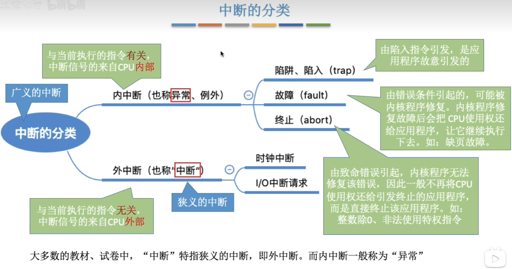

#### 中断机制和基本原理

**不同的中断信号，需要用不同的中断处理程序来处理。当CPU检测导中断信号后，会根据中断信号的类型去查询“中断向量表”，以此来找到对应的中断处理程序在内存中的存放位置，所以中断处理程序一定是内核程序，需要运行在“内核态”**

#### 总结
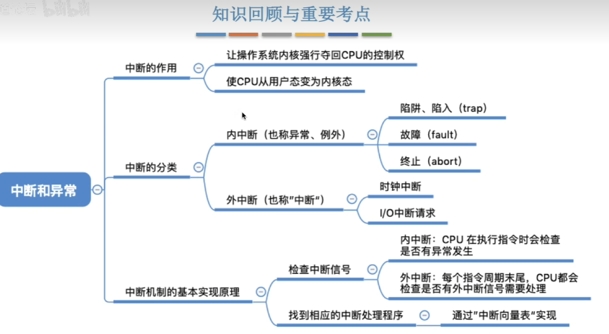

### 系统调用

#### 什么是系统调用

**“系统调用”时操作系统提供给应用程序（程序员/编程人员）使用的接口，可以理解为一种可供应用程序调用的特殊函数，应用程序可以通过系统调用来请求获得操作系统内核的服务**

#### 库函数和系统调用的区别

- 操作系统向上提供系统调用，使得上层程序能请求内核的服务
- 编程语言向上提供库函数，有时会将系统调用封装成库函数，以隐藏系统调用的一些细节，使程序员编程更方便
- 普通程序,可直接使用系统调用,也可以使用库函数,有的库函数涉及系统调用(创建新文件),有的不涉及(C里的math.h提供的函数)
  
#### 什么功能要用到系统调用
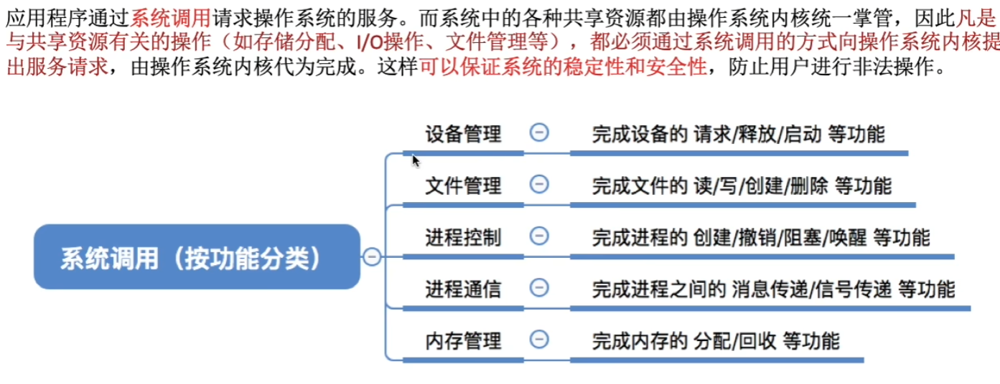

#### 系统调用的过程
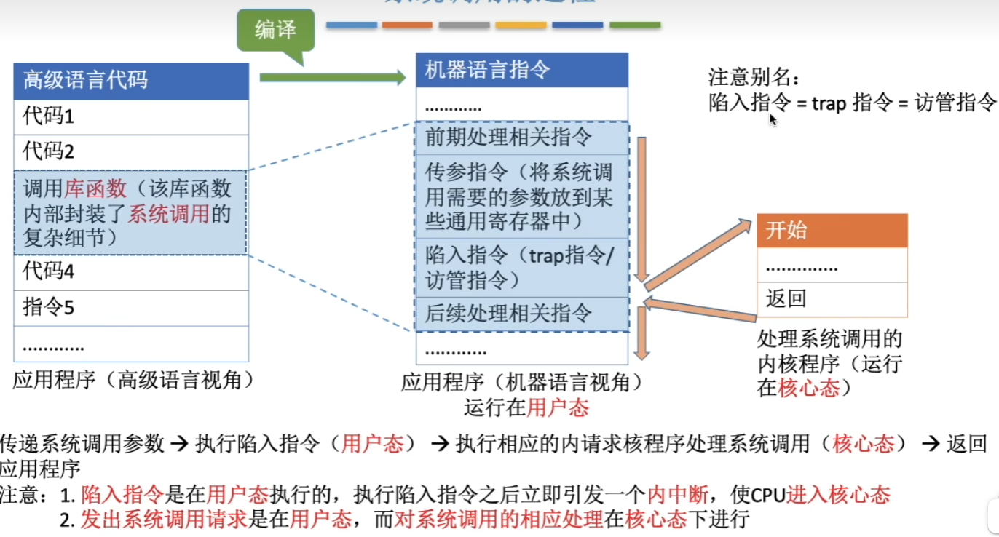

#### 总结
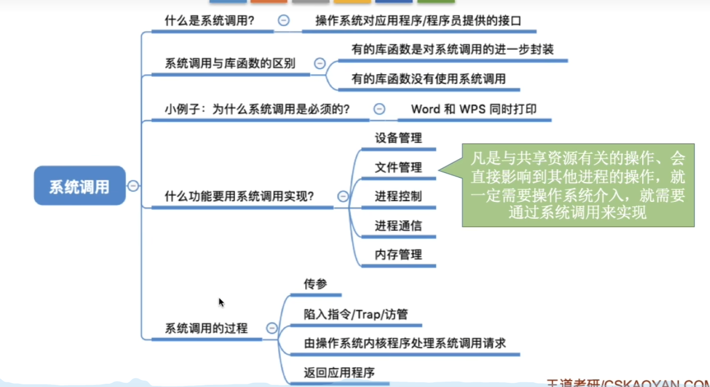

